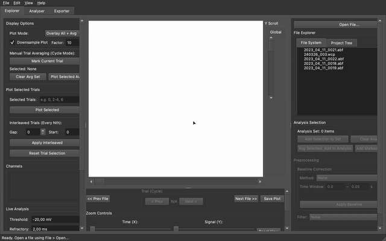

# Synaptipy

<!-- BADGES_START -->
[](https://github.com/anzalks/synaptipy/actions/workflows/test.yml)
[](https://codecov.io/gh/anzalks/synaptipy)
[](https://pypi.org/project/Synaptipy/)
[](https://pepy.tech/project/synaptipy)
[](https://github.com/anzalks/synaptipy/releases)
[](https://github.com/anzalks/synaptipy/releases)
[](https://www.python.org/)
[](LICENSE)
[](https://synaptipy.readthedocs.io/en/latest/)
[](https://github.com/anzalks/synaptipy)
<!-- BADGES_END -->

## Abstract

Synaptipy is a cross-platform application for the visualization and analysis of electrophysiological recordings. The software implements a modular architecture supporting interactive single-recording analysis, batch processing, and integration of user-written analysis routines via a plugin interface. The primary experimental focus is whole-cell patch-clamp and intracellular recordings; file I/O is handled via the [Neo](https://neo.readthedocs.io) library, enabling import of any supported electrophysiology format including extracellular, sharp-electrode, and multi-channel data.

Full documentation: [synaptipy.readthedocs.io](https://synaptipy.readthedocs.io/en/latest/)

---

## Installation

**WARNING: PySide6 must remain pinned to version 6.7.3 due to QTBUG-130070.**

### Default Install (PyPI)

The recommended approach for most users is to install Synaptipy directly via pip into a standard Python environment (Python 3.10-3.12).

```bash
pip install Synaptipy
```

### Standalone Application

Pre-compiled binaries for Windows, macOS, and Linux are available on the [Releases page](https://github.com/anzalks/Synaptipy/releases). Download the file matching your operating system from the v0.1.5 release assets:

- **Windows:** `Synaptipy_Setup_v0.1.5.exe`
- **macOS:** `Synaptipy_v0.1.5.dmg` - open the disk image and drag to Applications
- **Linux:** `Synaptipy-v0.1.5-x86_64.AppImage` - mark as executable (`chmod +x`) and run

### Advanced: From Source

For developers and users who want to modify the application, you can install directly from the source repository using Conda/Miniconda:

```bash
git clone https://github.com/anzalks/synaptipy.git
cd synaptipy
conda env create -f environment.yml
conda activate synaptipy
pip install -e ".[dev]"
synaptipy  # launch the application
```

For detailed installation instructions, system requirements, and troubleshooting, see the [full documentation](https://synaptipy.readthedocs.io/en/latest/user_guide.html#installation).

---

## Usage

### Graphical interface

To launch the graphical user interface:

```bash
synaptipy  # launch the application

# or equivalently:
python -m Synaptipy
```



Load a recording by dragging a file into the **Explorer** tab, then navigate to the **Analyser** tab to select a channel and run an analysis. Results are displayed in a table and can be exported to CSV.

### Programmatic (headless) use

The batch engine operates independently of the graphical interface:

```python
from Synaptipy.core.analysis.batch_engine import BatchAnalysisEngine
from pathlib import Path

engine = BatchAnalysisEngine()
pipeline = [
    {
        "analysis": "spike_detection",
        "scope": "all_trials",
        "params": {"threshold": -20.0, "refractory_ms": 2.0},
    }
]
results = engine.run_batch([Path("recording.abf")], pipeline)
print(results)
```

---

## Analysis Capabilities

Synaptipy provides built-in analysis routines covering passive membrane properties, action potential characterisation, firing dynamics, synaptic event detection, and evoked responses — organised into five module tabs. Each routine is available interactively in the graphical interface and as a composable unit in the batch processing pipeline.

### Tab 1: Intrinsic Properties

- **Baseline (RMP)** - mean membrane potential measured over a user-defined quiescent window; reports mean, standard deviation, and an estimate of linear drift
- **Input Resistance** - delta-V / delta-I from a voltage response to a hyperpolarising current step; returns mean, peak, and steady-state Rin separately to distinguish Ih-sag contributions
- **Tau (Time Constant)** - single-exponential or bi-exponential fit to the voltage decay after a current step; fit quality is gated by R² >= 0.80 and NaN is returned with an explicit flag when the gate is not met
- **Sag Ratio (Ih)** - peak-to-steady-state voltage ratio during a hyperpolarising step; includes rebound depolarisation measured after stimulus offset
- **I-V Curve** - current-voltage relationship across a multi-trial step protocol; fits an aggregate Rin from a linear regression and computes a dynamic rectification index
- **Capacitance** - membrane capacitance derived from Tau / Rin in current-clamp, or from capacitive-transient integration and mono-exponential fit in voltage-clamp

### Tab 2: Spike Analysis

- **Spike Detection** - threshold-crossing action-potential detection with refractory-period filtering; extracts per-spike amplitude, half-width, rise time, decay time, threshold voltage, after-hyperpolarisation (AHP), and afterdepolarisation amplitude (adp_amplitude; NaN when absent)
- **Phase Plane** - dV/dt vs. voltage trajectory for action-potential initiation dynamics; threshold voltage is detected via a kink-slope criterion; reports mean threshold voltage and maximum dV/dt

### Tab 3: Excitability

- **Excitability (F-I Curve)** - multi-trial rheobase, F-I slope, maximum firing frequency, and spike-frequency adaptation ratio; generates a popup F-I scatter plot
- **Burst Analysis** - max-ISI burst detection; reports burst count, mean spikes per burst, mean burst duration, and intra-burst frequency
- **Spike Train Dynamics** - inter-spike interval statistics including mean ISI, coefficient of variation (CV), local variation (LV), and CV2; generates a popup ISI plot

### Tab 4: Synaptic Events

- **Event Detection (Threshold)** - prominence-based detection that accommodates baseline drift and overlapping events; interactive event markers can be individually accepted or rejected
- **Event (Template Match)** - matched-filter cross-correlation using a bi-exponential kernel with user-defined rise and decay time constants; three kernel scales (1x, 2x, 3x the decay constant) are evaluated to accommodate dendritic-filtering variability
- **Event (Baseline Peak)** - direct baseline-to-peak amplitude detection with kinetics estimation for evoked or spontaneous events

### Tab 5: Evoked Responses

- **Evoked Sync** - extracts TTL or digital stimulus pulses from a secondary channel and correlates them with detected spikes or synaptic events; reports optical latency, response probability, and trial-to-trial jitter
- **Paired-Pulse Ratio** - stimulus-evoked PPR with residual decay correction: measures R1 and R2 amplitudes, fits a mono- or bi-exponential decay to the R1 tail, and subtracts the residual at the time of the second stimulus before computing the ratio. This is the GUI-accessible PPR analysis (Tab 5); there is no standalone PPR in Tab 4 (Synaptic Events).
- **Stimulus Train** - measures response amplitudes across a multi-pulse stimulus train and normalises each pulse to R1; classifies the result as facilitation or depression

---

## Visualization

Trace rendering is implemented via PyQtGraph. GPU-accelerated rendering via OpenGL is enabled automatically at startup when a hardware GPU is detected; the application falls back to software rendering on headless or CPU-only systems. The interface comprises a tree-based multi-file explorer with synchronized trial navigation and per-channel amplitude scaling. View-range management, zooming, and panning are performed explicitly via mouse interactions. Popup plots are generated for I-V curves, F-I curves, phase planes, and inter-spike interval distributions.

### Cross-file trial averaging

The Explorer tab implements grand-average construction across multiple files and trials. In **Cycle Single Trial** mode, the user captures individual trials via **Add Current Trial to Avg Set**. Trials from different files may be accumulated; the selection persists across the session. Activation of **Plot Selected Avg** overlays the mean trace. When recordings of different durations are selected, shorter trials are padded with `NaN` up to the maximum array length. This allows the application to produce a grand average that preserves the full length of the longest recording, smoothly dropping the statistical $N$ at the tails rather than truncating data.

---

## Batch Processing

The batch processing engine implements a composable pipeline architecture in which registered analysis routines are chained sequentially. Analysis operations execute in a background worker thread; the graphical interface remains responsive during execution. Recording metadata (sampling rate, gain, acquisition datetime) are extracted automatically. Results are exported to CSV in wide format (scalar metrics) or long format (event arrays); both formats are compatible with Python/Pandas, R, and MATLAB. NWB 2.x export includes icephys sweep tables, a three-step stimulus reconstruction fallback, and a discrete-event `ProcessingModule` for FAIR-compliant data archival.

---

## Plugin Interface

The software architecture comprises a central `AnalysisRegistry` that maps named analysis functions to the graphical interface and batch engine via a decorator pattern. Python scripts placed in `~/.synaptipy/plugins/` that use the `@AnalysisRegistry.register` decorator are discovered at startup and integrated into both the interactive analyser and batch pipeline without modification to the core package.

A documented template at `src/Synaptipy/templates/analysis_template.py` defines the required function signature and return schema.

```python
@AnalysisRegistry.register(
    name="my_analysis",
    label="My Analysis",
    ui_params=[{"name": "threshold", "type": "float", "default": -20.0}],
    plots=[{"name": "Trace", "type": "trace"}],
)
def my_analysis_wrapper(data, time, sampling_rate, **kwargs):
    ...
    return {
        "module_used": "my_analysis",
        "metrics": {"threshold_mv": kwargs["threshold"]},
    }
```

Every wrapper must return a nested dictionary with a `module_used` key and a `metrics` sub-dictionary. Keys prefixed with `_` pass arrays to plot overlays without appearing in the results table. The full specification is in `docs/extending_synaptipy.md`.

Plugin discovery follows two paths: `examples/plugins/` (bundled examples) and `~/.synaptipy/plugins/` (user additions). A user copy with an identical filename takes precedence. Toggling **Enable Custom Plugins** in **Edit > Preferences** reloads all plugins and regenerates the Analyser tab UI within the running process. Import errors in individual plugins are caught and logged; the remaining plugins continue to load normally.

---

## NWB Export and FAIR Compliance

Synaptipy exports raw traces and analysis results to [Neurodata Without Borders (NWB) 2.x](https://www.nwb.org):

- Raw electrophysiology traces stored as `CurrentClampSeries` / `VoltageClampSeries`
- Sweep-level organisation via `IntracellularRecordingsTable`, `SimultaneousRecordingsTable`, and `SequentialRecordingsTable` (NWB 2.x icephys best-practice hierarchy)
- Stimulus waveform reconstruction from ABF epoch metadata when the command channel is absent; a three-step fallback (raw channel -> synthetic reconstruction -> `stimulus=None` with a warning) ensures NWB conformance for recordings with incomplete stimulus records
- Discrete event data (spike times, synaptic event times, amplitudes) written as `DynamicTable` objects inside a `ProcessingModule` when the batch engine produces `_raw_arrays` output
- Electrode metadata and session provenance fields

---

## Supported File Formats

File I/O is handled through the [Neo](https://neo.readthedocs.io) library:

| Format | Extension(s) | Acquisition System |
|---|---|---|
| Axon Binary Format | `.abf` | Axon / Molecular Devices |
| WinWCP | `.wcp` | Strathclyde Electrophysiology Software |
| CED / Spike2 | `.smr`, `.smrx` | Cambridge Electronic Design |
| Igor Pro | `.ibw`, `.pxp` | WaveMetrics |
| Intan | `.rhd`, `.rhs` | Intan Technologies |
| Neurodata Without Borders | `.nwb` | NWB standard |
| BrainVision | `.vhdr` | Brain Products |
| European Data Format | `.edf` | EDF/EDF+ |
| Plexon | `.plx`, `.pl2` | Plexon |
| Open Ephys | `.continuous`, `.oebin` | Open Ephys |
| Tucker Davis Technologies | `.tev`, `.tbk` | TDT |
| Neuralynx | `.ncs`, `.nse`, `.nev` | Neuralynx |
| NeuroExplorer | `.nex` | NeuroExplorer |
| MATLAB | `.mat` | - |
| ASCII / CSV | `.txt`, `.csv`, `.tsv` | - |

Additional formats supported by Neo can be made available by adding the corresponding entry to the `IODict` in the infrastructure layer.

---

## Technical Architecture

Synaptipy follows a separation-of-concerns design with three layers:

- **Core layer** - pure Python analysis logic, fully decoupled from the graphical interface and independently testable
- **Application layer** - PySide6 (Qt6) user interface and plugin manager
- **Infrastructure layer** - file I/O via Neo and PyNWB; NWB export

| Component | Technology | Version |
|---|---|---|
| Language | Python | 3.10 - 3.12 (3.11 recommended) |
| GUI Framework | PySide6 | 6.7.3 (pinned) |
| Plotting Engine | PyQtGraph | 0.13.3+ |
| Electrophysiology I/O | Neo | 0.14.0+ |
| NWB Export | PyNWB | 3.1.0+ |
| Numerical Computation | SciPy / NumPy | 1.14.0+ / 2.0.0+ |

PySide6 is pinned to 6.7.3 on all platforms. PySide6 6.8.0 contains a known crash on Windows (QTBUG-130070) and 6.10.x introduced internal signal-connection changes that produce segmentation faults in the pyqtgraph rendering path under the offscreen platform plugin. The pin will be reviewed when an upstream fix is available.

---

## Documentation

- [Full documentation](https://synaptipy.readthedocs.io/en/latest/)
- [API reference](https://synaptipy.readthedocs.io/en/latest/api_reference.html)
- [Developer guide](https://synaptipy.readthedocs.io/en/latest/developer_guide.html)
- [Extending Synaptipy (plugin guide)](docs/extending_synaptipy.md)

---

## Contributing

Contributions are welcome. The preferred contribution pathway for new analysis routines is the plugin interface, which requires no modification to the core package. For changes to the core, infrastructure, or application layers, refer to [CONTRIBUTING.md](CONTRIBUTING.md) and the [developer guide](https://synaptipy.readthedocs.io/en/latest/developer_guide.html) for project conventions, coding standards, and the contribution workflow.


---

## Dependencies and Citations

Synaptipy builds on the following open-source libraries. When using Synaptipy in published research, please consider citing the relevant upstream packages alongside the Synaptipy repository.

| Library | Role | Citation |
|---|---|---|
| [Neo](https://neo.readthedocs.io) | Electrophysiology file I/O | Garcia S et al. (2014). *Front. Neuroinformatics* 8:10. [doi:10.3389/fninf.2014.00010](https://doi.org/10.3389/fninf.2014.00010) |
| [PyNWB](https://pynwb.readthedocs.io) | NWB data export | Rubel O et al. (2022). *eLife* 11:e78362. [doi:10.7554/eLife.78362](https://doi.org/10.7554/eLife.78362) |
| [SpikeInterface](https://spikeinterface.readthedocs.io) | Spike sorting integration (Plugin) | Buccino AP et al. (2020). *eLife* 9:e61834. [doi:10.7554/eLife.61834](https://doi.org/10.7554/eLife.61834) |
| [miniML](https://github.com/delvendahl/miniML) | Deep learning event detection (Plugin) | O'Neill PS et al. (2025). *eLife* 13:RP98485. [doi:10.7554/eLife.98485](https://doi.org/10.7554/eLife.98485) |
| [PySide6](https://doc.qt.io/qtforpython/) | Qt6 GUI framework | Qt for Python, The Qt Company. https://doc.qt.io/qtforpython/ |
| [PyQtGraph](https://www.pyqtgraph.org) | Signal rendering | Campagnola L et al. PyQtGraph. https://www.pyqtgraph.org |
| [SciPy](https://scipy.org) | Signal processing and curve fitting | Virtanen P et al. (2020). *Nature Methods* 17:261-272. [doi:10.1038/s41592-019-0686-2](https://doi.org/10.1038/s41592-019-0686-2) |
| [NumPy](https://numpy.org) | Array computation | Harris CR et al. (2020). *Nature* 585:357-362. [doi:10.1038/s41586-020-2649-2](https://doi.org/10.1038/s41586-020-2649-2) |
| [pandas](https://pandas.pydata.org) | Tabular result export | McKinney W (2010). *Proc. SciPy 2010*, 51-56. [doi:10.25080/Majora-92bf1922-00a](https://doi.org/10.25080/Majora-92bf1922-00a) |

### Scientific Method References

The analyses implemented in Synaptipy are grounded in peer-reviewed literature. Key references
are listed below; see the [full references page](https://synaptipy.readthedocs.io/en/latest/references.html)
in the documentation for a complete annotated bibliography.

**Action potential detection and kinetics:**
- Bean BP (2007). The action potential in mammalian central neurons. *Nat Rev Neurosci* 8:451-465. [doi:10.1038/nrn2148](https://doi.org/10.1038/nrn2148) - dV/dt threshold default (20 V/s)
- Hodgkin AL & Huxley AF (1952). *J Physiol* 117:500-544. [doi:10.1113/jphysiol.1952.sp004764](https://doi.org/10.1113/jphysiol.1952.sp004764) - foundational AP model
- Sekerli M et al. (2004). *IEEE Trans Biomed Eng* 51:1665-1672. [doi:10.1109/TBME.2004.827827](https://doi.org/10.1109/TBME.2004.827827) - maximum-curvature threshold method
- Naundorf B et al. (2006). *Nature* 440:1060-1063. [doi:10.1038/nature04610](https://doi.org/10.1038/nature04610) - artifact ceiling (300 V/s)

**Passive membrane properties:**
- Hamill OP et al. (1981). *Pflugers Arch* 391:85-100. [doi:10.1007/BF00656997](https://doi.org/10.1007/BF00656997) - patch-clamp; series resistance and capacitance
- Robinson RB & Siegelbaum SA (2003). *Annu Rev Physiol* 65:453-480. [doi:10.1146/annurev.physiol.65.092101.142734](https://doi.org/10.1146/annurev.physiol.65.092101.142734) - HCN / Ih current; peak vs. steady-state Rᵢₙ

**After-hyperpolarisation:**
- Storm JF (1987). *J Physiol* 385:733-759. [doi:10.1113/jphysiol.1987.sp016517](https://doi.org/10.1113/jphysiol.1987.sp016517) - fast AHP (BK, 1-5 ms)
- Sah P & Faber ESL (2002). *Prog Neurobiol* 66:345-353. [doi:10.1016/S0301-0082(02)00004-7](https://doi.org/10.1016/S0301-0082(02)00004-7) - medium AHP (SK, 10-50 ms)

**Spike-train statistics:**
- Holt GR et al. (1996). *J Neurophysiol* 75:1806-1814. [doi:10.1152/jn.1996.75.5.1806](https://doi.org/10.1152/jn.1996.75.5.1806) - CV and CV₂
- Shinomoto S et al. (2003). *Neural Comput* 15:2823-2842. [doi:10.1162/089976603322518759](https://doi.org/10.1162/089976603322518759) - Local Variation (LV)

**Burst detection:**
- Grace AA & Bunney BS (1984). *J Neurosci* 4:2877-2890. [doi:10.1523/JNEUROSCI.04-11-02877.1984](https://doi.org/10.1523/JNEUROSCI.04-11-02877.1984) - ISI burst criterion
- Harris KD et al. (2001). *Neuron* 32:141-149. [doi:10.1016/S0896-6273(01)00447-0](https://doi.org/10.1016/S0896-6273(01)00447-0) - dynamic ISI fraction (30%)

**Synaptic event detection:**
- Rall W (1967). *J Neurophysiol* 30:1138-1168. [doi:10.1152/jn.1967.30.5.1138](https://doi.org/10.1152/jn.1967.30.5.1138) - cable theory; dendritic filtering (2-3x tau)
- Hampel FR (1974). *J Am Stat Assoc* 69:383-393. [doi:10.1080/01621459.1974.10482962](https://doi.org/10.1080/01621459.1974.10482962) - MAD noise estimator (1.4826 factor)

**Paired-pulse ratio:**
- Zucker RS & Regehr WG (2002). *Annu Rev Physiol* 64:355-405. [doi:10.1146/annurev.physiol.64.092501.114547](https://doi.org/10.1146/annurev.physiol.64.092501.114547) - short-term synaptic plasticity
- Regehr WG (2012). *Cold Spring Harb Perspect Biol* 4:a005702. [doi:10.1101/cshperspect.a005702](https://doi.org/10.1101/cshperspect.a005702) - PPR facilitation/depression classification

**Signal filtering:**
- Savitzky A & Golay MJE (1964). *Anal Chem* 36:1627-1639. [doi:10.1021/ac60214a047](https://doi.org/10.1021/ac60214a047) - Savitzky-Golay smoothing
- Welch PD (1967). *IEEE Trans Audio Electroacoust* 15:70-73. [doi:10.1109/TAU.1967.1161901](https://doi.org/10.1109/TAU.1967.1161901) - Welch PSD / line noise detection

**Electrode corrections:**
- Barry PH & Lynch JW (1991). *J Membr Biol* 121:101-117. [doi:10.1007/BF01870526](https://doi.org/10.1007/BF01870526) - liquid junction potential correction
- Armstrong CM & Bezanilla F (1977). *J Gen Physiol* 70:567-590. [doi:10.1085/jgp.70.5.567](https://doi.org/10.1085/jgp.70.5.567) - P/N leak subtraction protocol

---

## License

Synaptipy is free and open-source software licensed under the GNU Affero General Public License v3 (AGPLv3). See the [LICENSE](LICENSE) file for full terms.
