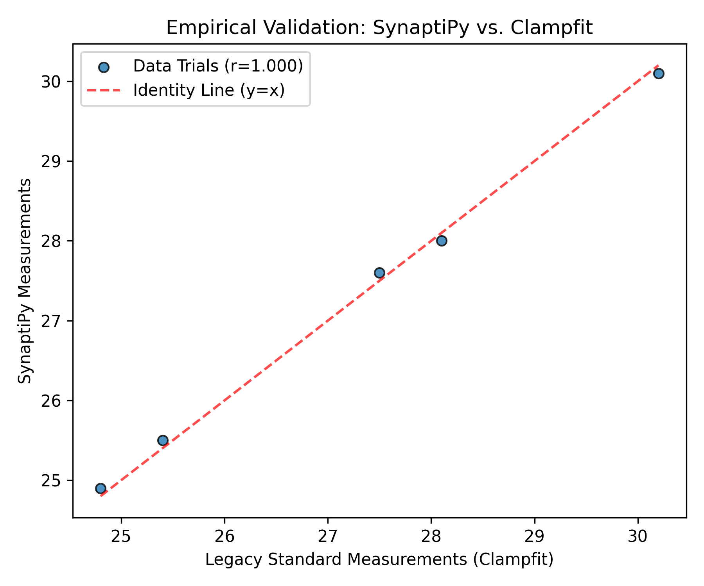

# Reproducibility Guide

This document describes how to reproduce Synaptipy's published analysis
results exactly.

## Pinned Environment

For day-to-day development, use the cross-platform install recipe:

```bash
conda env create -f environment.yml
conda activate synaptipy
pip install -e ".[dev]"
```

For exact reproduction of paper outputs on the original paper platform, use the
frozen files in `paper/envs/`:

```bash
conda env create -f paper/envs/conda_env_macos_arm64.yml
conda activate synaptipy
```

## Docker Container

For full system-level reproducibility:

```bash
docker build -t synaptipy .
docker run synaptipy validation/ -v
```

The Docker image copies `src/`, `tests/`, `validation/`, `examples/`, and
`paper/` so validation commands operate on the same tree used by reviewers.

## Paper Reproduction

The paper pipeline is manifest-driven. The fixed Allen Institute validation
cohort is listed in `paper/data_manifest.json`; NWB files are downloaded into
`paper/data/allen_cache/`, which is not committed to git.

Run lightweight checks before downloading data:

```bash
conda run -n synaptipy python paper/scripts/paper_figures/generate_paper_figures.py --check-only
conda run -n synaptipy python paper/scripts/generate_paper_tables.py --check-only
```

Regenerate tables and figures:

```bash
conda run -n synaptipy python paper/scripts/paper_figures/generate_paper_figures.py --run-analysis --force
```

Generated tables include companion provenance JSON files containing the manifest,
software versions, command-line options, and git commit.

## Random Seed Policy

Synaptipy's analysis algorithms are **fully deterministic** — no
stochastic elements are used in:
- Spike detection (threshold-based, not stochastic)
- Curve fitting (deterministic initial conditions from data statistics)
- Event detection (deterministic matched filter)
- Signal processing (IIR/FIR filters)

The only source of non-determinism is floating-point ordering in
parallel operations (disabled by default). All `curve_fit` initial
parameter estimates are derived deterministically from the input data
(e.g., initial tau estimate = time to 63% of steady-state voltage).

## Verification

After installing, verify your environment produces correct results:

```bash
conda run -n synaptipy python validation/validate_algorithms.py
```

All checks should pass with tolerances specified in the validation
scripts.

## Analysis Provenance and Eligibility

Synaptipy records the selected trials for batch analyses. Time-aware averages
interpolate eligible trials on a shared relative time axis and retain the
number of contributors at each sample. Empty traces, non-finite samples,
invalid time axes, and explicitly excluded trials are retained as quality
control decisions rather than silently contributing to an average.

Stimulus-locked analyses require recorded timing evidence or verified manual
stimulus times in the Protocol Map. A voltage trace is not treated as a TTL
signal when timing data are absent.

Every figure export writes a JSON sidecar next to the figure. It records the
export format, DPI, source recording metadata, and the analysis context passed
by the application, including visible trial selection where available.

## File-format Validation Tiers

ABF and NWB are validated Synaptipy acquisition formats. Their reader,
analysis, batch, and export paths have dedicated test coverage. Other formats
discoverable through Neo are experimental until they receive equivalent
end-to-end fixtures and validation tests. The extension list therefore
describes reader discovery, not equal validation status for every format.

### Empirical Comparison Example



`validation/benchmark_real_data.py` generates this comparison from its fixed
benchmark inputs. It is an example validation artifact, not a claim that every
recording or every analysis method will agree exactly with another package;
inspect the script, inputs, and its recorded tolerances when reproducing it.

## Version Pinning Rationale

| Dependency | Pin | Reason |
|-----------|-----|--------|
| NumPy >= 2.0.0 | Uses new copy semantics; array API changes in 2.0 |
| SciPy >= 1.14.0 | `sosfiltfilt` stability improvements |
| PySide6 == 6.7.3 | Known crashes in 6.8.0 (QTBUG-130070) and 6.10.x signal-connection changes |
| Neo >= 0.14.0 | ABF2 reader fixes for multi-protocol files |
| PyNWB >= 3.1.0 | IcephysFile schema corrections |
| h5py >= 3.14.0 | Thread-safety improvements for concurrent reads |
