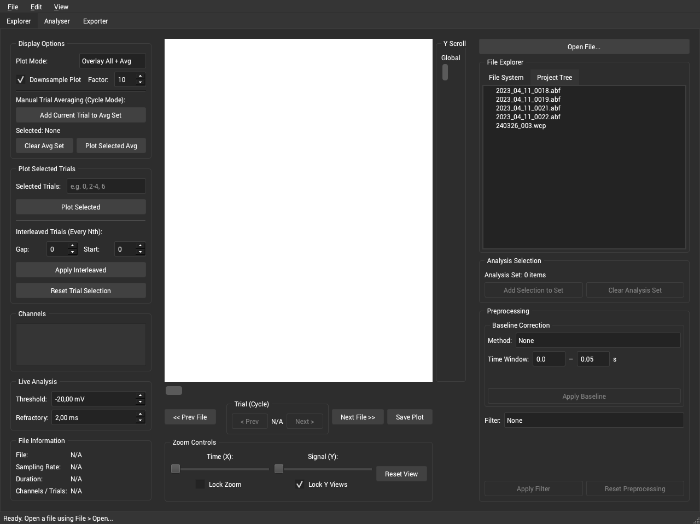
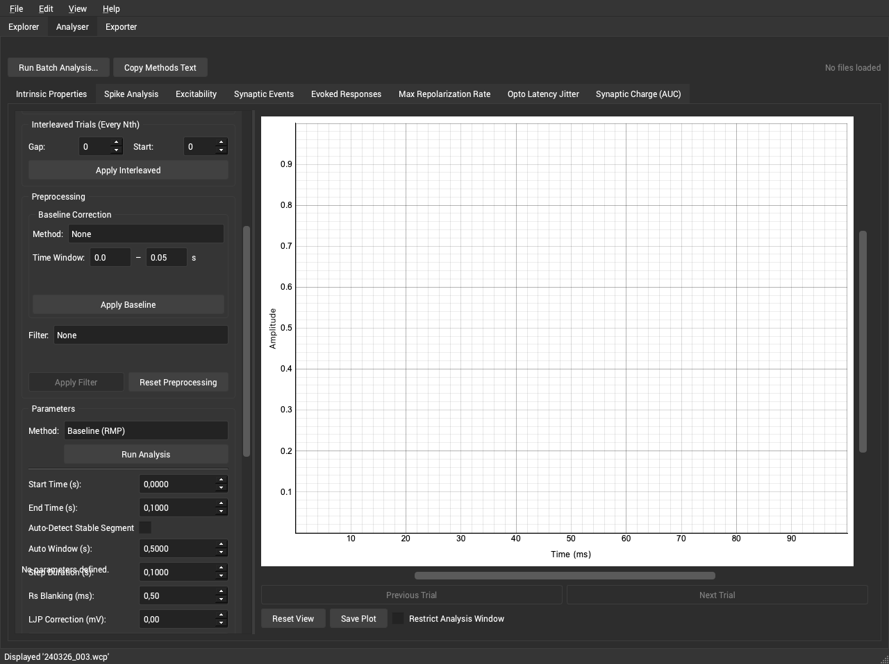
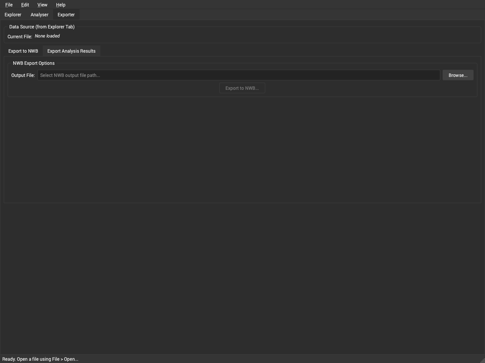

# Synaptipy User Tutorial and Documentation

Synaptipy is a comprehensive electrophysiology visualisation and analysis suite.
The primary focus is whole-cell patch-clamp and intracellular recordings; however,
any electrophysiology signal whose file format is supported by the
[Neo](https://neo.readthedocs.io) I/O library can be loaded, visualised, and processed.
Built on Python and Qt6, it provides OpenGL-accelerated signal visualisation,
15 built-in analysis modules, a composable batch processing engine, and an extensible
plugin interface. This tutorial covers every feature of the application in detail,
including the mathematical methods used in each analysis module.

---

## Table of Contents

1. [The Explorer Tab](#1-the-explorer-tab)
2. [Signal Preprocessing](#2-signal-preprocessing)
3. [The Analyser Tab](#3-the-analyser-tab)
   - [3.6 Adding Your Own Analysis Tab](#36-adding-your-own-analysis-tab)
4. [Analysis Modules — Detailed Reference](#4-analysis-modules--detailed-reference)
   - [4.1 Baseline / RMP](#41-baseline--rmp-analysis)
   - [4.2 Spike Detection](#42-spike-detection)
   - [4.3 Event Detection — Threshold Based](#43-event-detection--threshold-based)
   - [4.4 Event Detection — Template Match](#44-event-detection--template-match--deconvolution)
   - [4.5 Event Detection — Baseline Peak](#45-event-detection--baseline-peak--kinetics)
   - [4.6 Input Resistance](#46-input-resistance-rin)
   - [4.7 Tau (Time Constant)](#47-tau-membrane-time-constant)
   - [4.8 I-V Curve](#48-i-v-curve)
   - [4.9 Burst Analysis](#49-burst-analysis)
   - [4.10 Capacitance](#410-capacitance)
   - [4.11 Excitability (F-I Curve)](#411-excitability-f-i-curve)
   - [4.12 Optogenetic Synchronization](#412-optogenetic-synchronization)
   - [4.13 Phase Plane Analysis](#413-phase-plane-analysis)
   - [4.14 Spike Train Dynamics](#414-spike-train-dynamics)
   - [4.15 Sag Ratio (I_h)](#415-sag-ratio-i_h)
5. [Batch Processing](#5-batch-processing)
6. [The Exporter Tab](#6-the-exporter-tab)
7. [Preferences and Customization](#7-preferences-and-customization)

---

## 1. The Explorer Tab



The Explorer tab is the starting point for loading, browsing, and inspecting
electrophysiology data files. It supports all formats handled by the Neo library
(`.abf`, `.smr`, `.smrx`, `.nex`, `.h5`, and many more).

### 1.1 File Sidebar

- **File System Tree** — A live tree filtered to supported electrophysiology extensions.
  Click any file to load it instantly.
- **Project Tree** — Groups recordings hierarchically by **Animal → Slice → Cell**.
  Supports multi-selection for batch operations.
- **Drag & Drop** — Drag files from the OS file manager directly into the sidebar.
- **Quality Indicator** — Traffic-light badge per file:
  - Green **Good** — Clean signal, low drift, acceptable SNR.
  - Yellow **Warning** — Moderate baseline drift or line noise detected.
  - Red **Bad** — Excessive noise, drift, or signal quality issues.
  Hover to see detailed metrics: RMS noise, drift rate, and specific warnings.

### 1.2 Plot Canvas

- **Multi-Channel Display** — Each channel is plotted on a separate axis with linked
  X-axes for synchronized panning/zooming.
- **Hardware-Accelerated Rendering** — PyQtGraph + OpenGL, up to 60 fps on large files.
- **Interactive Navigation** — Scroll to zoom, drag to pan, toolbar for fine control.

### 1.3 Display Configuration Panel

- **Plot Mode**
  - *Overlay All + Average* — All trials with average highlighted in bold.
  - *Cycle Single Trial* — One trial at a time with Prev/Next buttons.
- **Auto Downsample** — Reduces data density automatically for very large files.
- **Manual Trial Averaging** (Cycle mode) — Add Current Trial / Clear Average /
  Plot Selected Average.
- **Trial Selection** — Trial Gap (skip N) and Start Trial index for sub-sampling.
- **Channel Visibility** — Per-channel show/hide checkboxes.
- **Live Spike Detection** — Real-time detection with configurable threshold
  (default −20 mV) and refractory period (default 2 ms). Spikes shown as red dots.

### 1.4 Toolbar

- **Prev / Next File** — Navigate through all files in the directory.
- **Save Plot** — Export the current view to PNG or PDF.
- **Reset View** — Restore default zoom and position.
- **Lock Zoom** — Preserve the viewport when switching files (useful for cross-file
  comparison of the same time window).
- **X Zoom Slider** — Fine horizontal zoom control.
- **Prev / Next Trial** (Cycle mode) — Navigate individual sweeps.

### 1.5 Y-Axis Controls

- **Lock Y Views** — Link or unlink Y-axes across channels.
- **Global Y Controls** (locked) — Single slider + scroll bar for all channels.
- **Per-Channel Y Controls** (unlocked) — Independent slider + scroll bar per channel.
  All controls are debounced (50 ms) for smooth interaction.

### 1.6 Adding Data to the Analyser

Click **"Add to Analysis Set"** to send the loaded file to the Analyser tab's queue.

---

## 2. Signal Preprocessing

A unified preprocessing panel is available in both the Explorer and Analyser tabs.
Preprocessing applied in any analysis sub-tab propagates globally to all sub-tabs.

### 2.1 Digital Filters

All filters use zero-phase Butterworth IIR via `scipy.signal.sosfiltfilt`
(no phase distortion).

| Filter | Parameters | Description |
|--------|------------|-------------|
| **Lowpass** | Cutoff (Hz), Order | Remove high-frequency noise |
| **Highpass** | Cutoff (Hz), Order | Remove slow baseline drift |
| **Bandpass** | Low & High cutoff (Hz), Order | Pass a specific frequency band |
| **Notch** | Center (Hz), Q-factor | Remove a narrow band (e.g., 50/60 Hz mains) — `scipy.signal.iirnotch` |
| **Comb** | Base freq (Hz), Q, N harmonics | Cascaded notch filters removing a fundamental and all harmonics |

### 2.2 Baseline Subtraction Methods

| Method | Description |
|--------|-------------|
| **Mode** | Subtract statistical mode (configurable decimal precision) |
| **Mean** | Subtract full-trace arithmetic mean |
| **Median** | Subtract full-trace median |
| **Linear Detrend** | Fit and remove a linear trend via `scipy.signal.detrend` |
| **Time Window** | Subtract mean of a user-specified region [t_start, t_end] |

### 2.3 Artifact Blanking

The preprocessing pipeline includes a general-purpose artifact blanking step
that can be applied before any analysis:

| Method | Description |
|--------|-------------|
| **Hold** | Replace the artifact window with the last pre-artifact sample value (sample-and-hold) |
| **Zero** | Set all samples in the artifact window to zero |
| **Linear** | Linearly interpolate between the last pre-artifact and first post-artifact sample |

Configure via the pipeline API:

```python
from Synaptipy.core.processing_pipeline import ProcessingPipeline

pipeline = ProcessingPipeline()
pipeline.add_step({
    "type": "artifact",
    "onset_time": 0.1,       # seconds
    "duration_ms": 5.0,      # milliseconds
    "method": "linear",      # "hold", "zero", or "linear"
})
```

### 2.4 Trace Quality Assessment

Computed on file load; shown as a traffic-light badge with tooltip:
- **SNR** — signal power / noise power.
- **Baseline Drift** — linear regression slope over the full trace (mV/s).
- **Line Noise** — Welch PSD at 50/60 Hz.
- **Low-Frequency Variance** — energy below a configurable cutoff.

---

## 3. The Analyser Tab



The central analysis engine. All 15 analysis sub-tabs are auto-built from registry
metadata — parameter widgets, interactive plots, and result tables are generated
automatically.

### 3.1 File and Data Source Selection

- **File Selector** — All files in the analysis set.
- **Channel Selector** — Choose the channel to analyze. Clamp mode (CC / VC) is
  auto-detected from channel units and controls which parameters appear.
- **Data Source** — Average (mean of all trials), Trial 1, Trial 2, etc.
- **Drag-and-Drop File List** — Drop files directly from the Explorer sidebar.

### 3.2 Analysis Sub-Tab Features

Each sub-tab provides:

- **Parameter Panel** — Auto-generated spin boxes, combo boxes, and checkboxes.
  All include tooltips, unit suffixes, valid min/max ranges.
  - *Free-form numeric entry* — Number fields accept typed values directly;
    intermediate states (a lone `−`, an empty field, etc.) are tolerated while
    typing and validated only on commit. Stepping uses adaptive decimal increments.
  - *Interactive / Manual mode* — Sub-tabs with draggable plot regions expose a
    mode selector. In **Interactive** mode the time-window spinboxes are read-only
    (their values are driven by the plot regions); switching to **Manual** mode
    unlocks all spinboxes for direct entry.
  - *Conditional visibility* — Parameters that are irrelevant for the current
    clamp mode, analysis type, or detection method are hidden automatically.
- **Interactive Plot**
  - *Draggable Regions* — Color-coded overlays (blue = baseline, red = response,
    orange = peak, green = steady-state) bidirectionally linked to parameter boxes.
  - *Interactive Event Markers* — Click to remove; Ctrl+click on trace to add.
  - *Draggable Threshold Line* — Syncs with the threshold parameter.
  - *Artifact Overlay* — Semi-transparent green shading on detected artifact windows.
  - *Fit Overlays* — Exponential or regression curves overlaid on the trace.
- **Results Table** — Parameter / Value pairs for all computed metrics.
- **Clamp-Mode Awareness** — Parameters show/hide automatically (CC vs. VC).

### 3.3 Shared Controls

- **Run Analysis** — Executes with current parameters; also auto-triggers (debounced)
  on parameter change.
- **Save Result** — Accumulate result to the session for later export/comparison.
- **Copy Methods Text** — Publication-ready methods paragraph copied to clipboard.
- **Run Batch** — Opens the Batch Analysis Dialog (see Section 5).
- **Cross-Tab Zoom Sync** — Zoom states shared across all analysis sub-tabs.

### 3.4 Popup Windows

- **I-V Curve popup** — Scatter + linear regression with R² annotation.
- **F-I Curve popup** — Firing frequency vs. current with regression.
- **Phase Plane popup** — dV/dt vs. V with threshold circles and max-dV/dt crosses.
- **ISI Plot popup** — ISI number vs. ISI duration scatter.

### 3.5 Session Summary

Shows all accumulated results with **Mean ± SD** for numeric columns across cells.

### 3.6 Adding Your Own Analysis Tab

You can add a completely new analysis tab to the Analyser **without touching any
Synaptipy source code**.  All you need is a single Python file — Synaptipy
generates the parameter panel, Run button, results table, and plot overlays
automatically from the metadata you provide.

#### Step 1 — Create the plugin file

Copy the starter template that ships with Synaptipy:

```bash
# macOS / Linux
cp src/Synaptipy/templates/plugin_template.py ~/.synaptipy/plugins/my_analysis.py

# Windows (PowerShell)
Copy-Item src\Synaptipy\templates\plugin_template.py ~\.synaptipy\plugins\my_analysis.py
```

> **Plugin folder location by platform:**
>
> | Platform | Path |
> |----------|------|
> | macOS / Linux | `~/.synaptipy/plugins/` |
> | Windows | `C:\Users\<YourUsername>\.synaptipy\plugins\` |
>
> If the folder does not exist yet, either create it manually or simply start
> Synaptipy once — it creates the folder automatically.
>
> **Windows tip:** You can open the folder in Explorer by typing
> `%USERPROFILE%\.synaptipy\plugins` in the address bar, or in PowerShell:
> `explorer "$HOME\.synaptipy\plugins"`

#### Step 2 — Write your analysis function

Open `~/.synaptipy/plugins/my_analysis.py` in any text editor.  The file has two
parts:

**Part A — Your analysis logic** (plain Python + NumPy, no GUI code):

```python
import numpy as np

def calculate_snr(data, time, sampling_rate, noise_start, noise_end,
                  signal_start, signal_end):
    """Calculate signal-to-noise ratio in dB."""
    # Convert seconds → sample indices
    ni0 = int(np.searchsorted(time, noise_start, side="left"))
    ni1 = int(np.searchsorted(time, noise_end,   side="right"))
    si0 = int(np.searchsorted(time, signal_start, side="left"))
    si1 = int(np.searchsorted(time, signal_end,   side="right"))

    noise_rms  = float(np.sqrt(np.mean(data[ni0:ni1] ** 2)))
    signal_rms = float(np.sqrt(np.mean(data[si0:si1] ** 2)))
    snr_db     = float(20.0 * np.log10(signal_rms / noise_rms))

    return {
        "snr_db":     round(snr_db, 2),
        "noise_rms":  round(noise_rms, 4),
        "signal_rms": round(signal_rms, 4),
    }
```

**Part B — Register it with the decorator:**

```python
from Synaptipy.core.analysis.registry import AnalysisRegistry

@AnalysisRegistry.register(
    name="snr_analysis",               # unique internal ID
    label="Signal-to-Noise Ratio",     # name shown on the tab
    ui_params=[...],                   # parameter widgets  (see below)
    plots=[...],                       # plot overlays      (see below)
)
def run_snr(data, time, sampling_rate, **kwargs):
    """Wrapper — pulls GUI values from kwargs and calls the logic."""
    return calculate_snr(
        data, time, sampling_rate,
        noise_start  = kwargs.get("noise_start",  0.0),
        noise_end    = kwargs.get("noise_end",    0.1),
        signal_start = kwargs.get("signal_start", 0.1),
        signal_end   = kwargs.get("signal_end",   0.5),
    )
```

> **The wrapper signature is fixed:** `def f(data, time, sampling_rate, **kwargs)`
> — Synaptipy passes in the trace array, time array, and sampling rate, plus
> every parameter widget value as a keyword argument.

#### Step 3 — Define parameter widgets (`ui_params`)

Each dict in the `ui_params` list creates one widget in the parameter panel.
Four widget types are available:

| Type | Widget | Example |
|------|--------|---------|
| `"float"` | Decimal spin box | `{"name": "threshold", "label": "Threshold (mV):", "type": "float", "default": -20.0, "min": -200, "max": 200, "decimals": 2}` |
| `"int"` | Integer spin box | `{"name": "min_events", "label": "Min Events:", "type": "int", "default": 3, "min": 1, "max": 10000}` |
| `"bool"` | Check box | `{"name": "auto_detect", "label": "Auto-Detect Baseline", "type": "bool", "default": False}` |
| `"choice"` | Drop-down | `{"name": "direction", "label": "Direction:", "type": "choice", "choices": ["negative", "positive"], "default": "negative"}` |

Full example for the SNR analysis:

```python
ui_params=[
    {"name": "noise_start",  "label": "Noise Start (s):",  "type": "float",
     "default": 0.0, "min": 0.0, "max": 1e9, "decimals": 4},
    {"name": "noise_end",    "label": "Noise End (s):",    "type": "float",
     "default": 0.1, "min": 0.0, "max": 1e9, "decimals": 4},
    {"name": "signal_start", "label": "Signal Start (s):", "type": "float",
     "default": 0.1, "min": 0.0, "max": 1e9, "decimals": 4},
    {"name": "signal_end",   "label": "Signal End (s):",   "type": "float",
     "default": 0.5, "min": 0.0, "max": 1e9, "decimals": 4},
],
```

**Optional extras on any parameter:**

- `"tooltip": "Hover text"` — shows on mouse-over.
- `"visible_when": {"param": "mode", "value": "advanced"}` — shows this widget
  only when another widget named `"mode"` has the value `"advanced"`.

#### Step 4 — Define plot overlays (`plots`)

Each dict in the `plots` list draws something on the trace after the analysis
runs.  Common overlay types:

| Type | What it draws | Example |
|------|---------------|---------|
| `"interactive_region"` | Draggable shaded region synced to two float parameters | `{"type": "interactive_region", "data": ["noise_start", "noise_end"], "color": "b"}` |
| `"hlines"` | Horizontal lines at result values | `{"type": "hlines", "data": ["threshold"], "color": "r", "styles": ["dash"]}` |
| `"vlines"` | Vertical lines at result values | `{"type": "vlines", "data": "stim_times", "color": "c"}` |
| `"markers"` | Scatter dots at (x, y) arrays from result | `{"type": "markers", "x": "peak_times", "y": "peak_voltages", "color": "r"}` |
| `"threshold_line"` | Draggable h-line synced to a parameter | `{"type": "threshold_line", "param": "threshold"}` |
| `"overlay_fit"` | Curve overlay (e.g. exponential fit) | `{"type": "overlay_fit", "x": "_fit_t", "y": "_fit_v", "color": "r"}` |
| `"popup_xy"` | Opens a separate plot window | `{"type": "popup_xy", "title": "F-I Curve", "x": "currents", "y": "rates", "x_label": "I (pA)", "y_label": "f (Hz)"}` |

Full example — two draggable windows and a dashed line at the noise level:

```python
plots=[
    {"type": "interactive_region", "data": ["noise_start", "noise_end"],   "color": "b"},
    {"type": "interactive_region", "data": ["signal_start", "signal_end"], "color": "g"},
    {"type": "hlines", "data": ["noise_rms"], "color": "b", "styles": ["dash"]},
],
```

#### Step 5 — Control what shows in the results table

Every key in the dict your function returns becomes a row in the results table.
To keep helper data out of the table (e.g. arrays used only by plot overlays),
prefix the key with an underscore:

```python
return {
    "snr_db":       42.3,        # ← shown in results table
    "noise_rms":    0.15,        # ← shown in results table
    "_fit_curve":   some_array,  # ← hidden (used by overlay_fit)
}
```

If your function encounters an error, return `{"error": "message"}` and the GUI
will display the message instead of a results table.

#### Step 6 — Restart and use

Save your file, restart Synaptipy, and your new tab appears in the Analyser:

```
Analyser → ... | Baseline | Spikes | Signal-to-Noise Ratio
```

Load a file, select a channel, and click **Run Analysis** (or just change a
parameter — analysis re-runs automatically).  The results table, plot overlays,
and batch processing all work immediately.

#### Tips

- **No rebuild needed** — just save the `.py` file and restart Synaptipy.
- **Errors are safe** — if your plugin has a syntax error or crashes, Synaptipy
  logs the error and keeps running (your tab simply won't appear).  Check the log
  at `~/.synaptipy/logs/` (Windows: `C:\Users\<YourUsername>\.synaptipy\logs\`).
- **Multiple plugins** — put as many `.py` files in the plugins folder as you
  like; each one with an `@AnalysisRegistry.register` decorator creates a
  separate tab.
- **Use any installed package** — your plugin can import SciPy, scikit-learn,
  or anything installed in the same Python environment.
- **Template location** — the ready-to-copy template is at
  `src/Synaptipy/templates/plugin_template.py`.
- **Full reference** — for the complete list of all parameter types, all 12
  plot overlay types, and advanced features like conditional visibility, see
  [Writing Custom Analysis Plugins](../extending_synaptipy.md).

---

## 4. Analysis Modules — Detailed Reference

> **Formal mathematics:** For publication-ready LaTeX definitions of every metric
> computed below, see the [Algorithmic Definitions](../algorithmic_definitions.md) page.

### 4.1 Baseline / RMP Analysis

**Registry name**: `rmp_analysis` | **Tab label**: *Baseline (RMP)*

Computes resting membrane potential and baseline stability.

#### Parameters

| Parameter | Type | Description |
|-----------|------|-------------|
| Baseline Start | float (s) | Start of baseline window |
| Baseline End | float (s) | End of baseline window |
| Auto Detect | bool | Find most stable window automatically |
| Window Duration | float (s) | Sliding window size (auto mode) |
| Step Duration | float (s) | Sliding window step (auto mode) |

#### Methods

- **RMP** = mean voltage in baseline window.
- **SD** bounds = RMP ± std(baseline).
- **Drift** = linear regression slope (mV/s).
- **Auto-detect**: `find_stable_baseline()` uses sliding-window variance
  minimization to locate the quietest trace segment.

#### Results

`rmp_mv`, `rmp_std`, `rmp_mv_plus_sd`, `rmp_mv_minus_sd`, `rmp_drift`,
`rmp_duration`

#### Visualization

Green draggable region; solid red h-line at RMP; dashed red h-lines at ±SD.

---

### 4.2 Spike Detection

**Registry name**: `spike_detection` | **Tab label**: *Spike Detection*

Automated detection and comprehensive parameterization of action potentials.

#### Parameters

| Parameter | Type | Description |
|-----------|------|-------------|
| Threshold | float (mV) | Detection threshold (default −20 mV) |
| Refractory Period | float (s) | Minimum inter-spike interval (default 2 ms) |
| Peak Search Window | float (s) | Post-threshold window to find peak |
| dV/dt Threshold | float (V/s) | Derivative threshold for onset |
| AHP Window | float (s) | Post-peak window for AHP minimum |
| Onset Lookback | float (s) | Lookback for onset refinement |

#### Methods

- **Onset** — `numpy.gradient` computes dV/dt; onset where dV/dt > `dvdt_threshold`.
  More robust against baseline drift than amplitude thresholding.
- **Per-spike features** (vectorized NumPy):
  - Amplitude = V_peak − V_threshold
  - Half-width at 50% amplitude (linear interpolation)
  - Rise time 10–90%, Decay time 90–10% (sub-sample precision)
  - AHP depth = V_threshold − V_min_post (Savitzky-Golay smoothed)
  - AHP duration = repolarization to AHP recovery
  - ADP amplitude = local max after AHP trough
  - Max / Min dV/dt (V/s)
- **ISI statistics** via `numpy.diff(spike_times)`.
- **Multi-sweep**: `analyze_multi_sweep_spikes()` aggregates across all trials.

#### Results

`spike_count`, `mean_freq_hz`, `spike_times`, mean ± SD for: `amplitude`,
`half_width`, `rise_time`, `decay_time`, `ahp_depth`, `ahp_duration`,
`adp_amplitude`, `max_dvdt`, `min_dvdt`

#### Visualization

Red dashed threshold h-line; red dot markers at spike peaks.

---

### 4.3 Event Detection — Threshold Based

**Registry name**: `event_detection_threshold` | **Tab label**: *Event Detection*

Detects mEPSCs / mIPSCs using adaptive prominence-based thresholding.
A **method selector** dropdown switches between all three event detection
algorithms (sections 4.3 – 4.5).

#### Parameters

| Parameter | Type | Description |
|-----------|------|-------------|
| Threshold | float (pA/mV) | Minimum event amplitude |
| Direction | combo | `negative` or `positive` |
| Refractory Period | float (s) | Minimum inter-event interval |
| Rolling Baseline Window | float (ms) | Rolling median baseline window |
| Reject Artifacts | bool | Gradient-based artifact rejection |
| Artifact Slope Threshold | float | Gradient threshold for artifacts |
| Artifact Padding | float (ms) | Dilation padding around artifacts |

#### Methods

1. Rolling median subtraction removes slow drift.
2. MAD noise estimate: σ = 1.4826 × MAD.
3. Adaptive prominence = max(threshold, 2σ).
4. `scipy.signal.find_peaks` with prominence, height, refractory distance,
   and min-width constraints. Events < 0.2 ms rejected as non-physiological.
5. Artifact rejection: gradient thresholding + asymmetric binary dilation.

#### Results

`event_count`, `frequency_hz`, `mean_amplitude`, `amplitude_sd`,
`event_times`, `event_indices`, `event_amplitudes`

#### Visualization

Interactive scatter markers (click to remove; Ctrl+click to add);
draggable threshold line; artifact overlay.

---

### 4.4 Event Detection — Template Match / Deconvolution

**Registry name**: `event_detection_deconvolution` | **Tab label**: *Event (Template Match)*

Detects events via a matched-filter approach using a bi-exponential template.

#### Parameters

| Parameter | Type | Description |
|-----------|------|-------------|
| τ Rise | float (ms) | Rise time constant |
| τ Decay | float (ms) | Decay time constant |
| Threshold (SD) | float | Z-score detection threshold |
| Direction | combo | Event polarity |
| Rolling Baseline Window | float (ms) | Baseline subtraction window |
| Reject Artifacts | bool | Enable artifact rejection |
| Min Event Distance | float (ms) | Minimum event separation |

#### Methods

1. Bi-exponential kernel: K(t) = exp(−t/τ_decay) − exp(−t/τ_rise), normalized.
2. FFT cross-correlation (matched filter) with the time-reversed template.
3. Z-score normalization by MAD; peaks above `threshold_sd` are events.
4. Local argmax refinement aligns detected times to true event peaks.

#### Results

Same as threshold method plus `tau_rise_ms`, `tau_decay_ms`.

#### Visualization

Same interactive markers / threshold line / artifact overlay.

---

### 4.5 Event Detection — Baseline Peak / Kinetics

**Registry name**: `event_detection_baseline_peak` | **Tab label**: *Event (Baseline Peak)*

Detects events by finding the most stable baseline and locating peaks above the
noise floor.

#### Parameters

| Parameter | Type | Description |
|-----------|------|-------------|
| Direction | combo | Event polarity |
| Auto Baseline | bool | Variance-minimization baseline search |
| Threshold (SD Factor) | float | Multiples of noise SD |
| Min Event Separation | float (ms) | Minimum inter-event gap |
| Rolling Baseline Window | float (ms) | Rolling baseline size |
| Baseline Window | float (s) | Manual window (if auto disabled) |
| Baseline Step | float (s) | Manual step size |

#### Methods

1. Stable baseline via sliding-window variance minimization.
2. MAD noise estimate from baseline region.
3. Prominence-based peaks, min prominence = 0.5 × threshold.
4. Optional Butterworth lowpass pre-filter.
5. Biological minimum event width ≥ 0.2 ms.

#### Results

`event_count`, `event_indices`, `event_times`, `event_amplitudes`

---

### 4.6 Input Resistance (Rin)

**Registry name**: `rin_analysis` | **Tab label**: *Input Resistance*

Computes passive membrane input resistance from step protocols.

#### Parameters

| Parameter | Type | Description |
|-----------|------|-------------|
| Current Amplitude | float (pA) | CC mode step (hidden in VC) |
| Voltage Step | float (mV) | VC mode step (hidden in CC) |
| Auto Detect Pulse | bool | Derivative-based pulse edge detection |
| Baseline Start / End | float (s) | Baseline window (read-only in Interactive mode) |
| Response Start / End | float (s) | Steady-state window (read-only in Interactive mode) |

#### Methods

- Ohm's Law: Rin (MΩ) = |ΔV| / |ΔI|, where ΔV = V_ss − V_baseline.
- Conductance: G (μS) = ΔI / ΔV.
- **Auto-detection** uses the first and second derivatives of the stimulus channel
  to locate step edges. The detected windows are validated for adequacy (≥ 2
  samples each); if validation fails (e.g. the trace contains action potentials
  that mislead the derivative search), the analysis transparently falls back to
  the user-specified spinbox values. After a successful run, the spinboxes are
  updated to reflect the windows actually used.

#### Results

`rin_mohm`, `conductance_us`, `voltage_deflection_mv`, `current_injection_pa`,
`baseline_voltage_mv`, `steady_state_voltage_mv`, `sag_ratio`, `sag_percentage`

The sag ratio is computed with configurable `peak_smoothing_ms` (default 5 ms)
and `rebound_window_ms` (default 100 ms) parameters.  For standalone sag ratio
analysis with dedicated parameter controls, see
[§4.15 Sag Ratio (I_h)](#415-sag-ratio-i_h).  See also
[Algorithmic Definitions §4](../algorithmic_definitions.md) for the full formula.

#### Visualization

Blue region (baseline) + red region (response); blue h-line at baseline
voltage; red h-line at steady-state voltage.

---

### 4.7 Tau (Membrane Time Constant)

**Registry name**: `tau_analysis` | **Tab label**: *Tau (Time Constant)*

Fits the membrane charging curve to extract the passive time constant.

#### Parameters

| Parameter | Type | Description |
|-----------|------|-------------|
| Stim Start Time | float (s) | Current step onset |
| Fit Duration | float (s) | Duration of decay region to fit |
| Tau Model | combo | `mono` or `bi` exponential |
| Artifact Blanking | float (ms) | Exclude N ms after stimulus onset |
| Tau Bound Min / Max | float (ms) | Bounds for τ optimizer |

#### Methods

- **Mono**: V(t) = V_ss + (V_0 − V_ss) · exp(−t/τ), optimized via
  `scipy.optimize.curve_fit` (bounded non-linear least squares).
- **Bi**: V(t) = V_ss + A_fast · exp(−t/τ_fast) + A_slow · exp(−t/τ_slow),
  separating fast capacitive from slower dendritic components.
- Artifact blanking excludes the first N ms after stimulus onset.

#### Results

Mono: `tau_ms`. Bi: `tau_fast_ms`, `tau_slow_ms`, `amp_fast`, `amp_slow`.
Plus `fit_time` and `fit_values` for the overlay.

#### Visualization

Red exponential fit curve overlaid on the raw voltage trace.

---

### 4.8 I-V Curve

**Registry name**: `iv_curve_analysis` | **Tab label**: *I-V Curve*
**Requires multiple trials** (multi-sweep step protocol).

#### Parameters

| Parameter | Type | Description |
|-----------|------|-------------|
| Start Current | float (pA) | Current of sweep 0 |
| Step Current | float (pA) | Current increment per sweep |
| Baseline Start / End | float (s) | Baseline measurement window |
| Response Start / End | float (s) | Steady-state measurement window |

#### Methods

- Per sweep n: I_n = I_start + n × I_step;
  ΔV_n = mean(V_response) − mean(V_baseline).
- Linear regression ΔV vs. ΔI: slope = Rin (MΩ), R² = goodness of fit.

#### Results

`rin_aggregate_mohm`, `iv_intercept`, `iv_r_squared`, `delta_vs`,
`current_steps`

#### Visualization

Popup I-V scatter + linear regression line with slope annotation and R².

---

### 4.9 Burst Analysis

**Registry name**: `burst_analysis` | **Tab label**: *Burst*

Identifies firing bursts based on inter-spike interval (ISI) criteria.

#### Parameters

| Parameter | Type | Description |
|-----------|------|-------------|
| Threshold | float (mV) | Spike detection threshold |
| Max ISI (Start) | float (s) | Maximum ISI to start a burst |
| Max ISI (End) | float (s) | Maximum ISI to continue a burst |
| Min Spikes | int | Minimum spikes per burst |

#### Methods

1. Threshold-crossing spike detection.
2. ISI-based detector: burst starts when ISI ≤ max_isi_start; continues while
   ISI ≤ max_isi_end; groups with < min_spikes are discarded.

#### Results

`burst_count`, `spikes_per_burst_avg`, `burst_duration_avg_s`,
`burst_freq_hz`, `bursts`

#### Visualization

Red bracket lines spanning each burst, with spike markers inside each burst.

---

### 4.10 Capacitance

**Registry name**: `capacitance_analysis` | **Tab label**: *Capacitance*

Estimates whole-cell membrane capacitance from step protocols.

#### Parameters

| Parameter | Type | Description |
|-----------|------|-------------|
| Mode | combo | Current-Clamp or Voltage-Clamp |
| Current Amplitude | float (pA) | Step size (CC mode) |
| Voltage Step | float (mV) | Step size (VC mode) |
| Baseline Start / End | float (s) | Baseline window |
| Response Start / End | float (s) | Response window |

#### Methods

- **CC mode**: C_m = τ / R_in. Tau and Rin computed first; τ(ms) / R(MΩ) → C(pF).
- **VC mode**: C_m = Q / ΔV, where Q = ∫(I_transient − I_ss) dt via
  `scipy.integrate.trapezoid`.

#### Results

`capacitance_pf`, `tau_ms`, `rin_mohm`, `mode`

---

### 4.11 Excitability (F-I Curve)

**Registry name**: `excitability_analysis` | **Tab label**: *Excitability*
**Requires multiple trials** (increasing current-step protocol).

#### Parameters

| Parameter | Type | Description |
|-----------|------|-------------|
| Threshold | float (mV) | Spike detection threshold |
| Start Current | float (pA) | Current of sweep 0 |
| Step Current | float (pA) | Current increment per sweep |
| Refractory Period | float (ms) | Refractory period for spike detection |

#### Methods

1. Per-sweep spike detection with threshold + refractory filtering.
2. Rheobase = minimum current eliciting ≥ 1 spike.
3. F-I slope via linear regression: f = slope × I + b (Hz/pA).
4. Spike Frequency Adaptation per sweep = last ISI / first ISI.

#### Results

`rheobase_pa`, `fi_slope`, `fi_r_squared`, `max_freq_hz`, `frequencies`,
`adaptation_ratios`, `current_steps`

#### Visualization

Popup F-I scatter with regression line and slope annotation.

---

### 4.12 Optogenetic Synchronization

**Registry name**: `optogenetic_sync` | **Tab label**: *Optogenetic Synchronization*
**Requires secondary TTL channel** (dropdown to select the optical stimulus channel).

#### Parameters

| Parameter | Type | Description |
|-----------|------|-------------|
| TTL Threshold | float (V) | Binarize threshold for TTL channel |
| Response Window | float (ms) | Post-stimulus event search window |
| Event Detection Type | combo | `Spikes` / `Events (Threshold)` / `Events (Template)` |

**Spike mode** (`Event Detection Type = Spikes`):

| Parameter | Type | Description |
|-----------|------|-------------|
| Spike Threshold | float (mV) | AP detection threshold |

**Threshold-event mode** (`Event Detection Type = Events (Threshold)`):

| Parameter | Type | Description |
|-----------|------|-------------|
| Event Threshold | float (same units as signal) | Amplitude threshold |
| Event Direction | combo | `positive` / `negative` |
| Refractory Period | float (s) | Minimum inter-event interval |

**Template mode** (`Event Detection Type = Events (Template)`):

| Parameter | Type | Description |
|-----------|------|-------------|
| Rise Tau | float (ms) | Double-exponential template rise time constant |
| Decay Tau | float (ms) | Double-exponential template decay time constant |
| Template Threshold | float (SD) | Detection threshold in units of template SD |
| Template Direction | combo | `positive` / `negative` |

Parameters for the inactive detection modes are hidden automatically.

#### Methods

1. TTL edge detection: binarize → `numpy.diff` for rising edges.
2. For each stimulus onset, the response window is searched for an event using
   the selected detection method:
   - **Spikes** — threshold-crossing AP detection with refractory filtering.
   - **Events (Threshold)** — prominence-based threshold crossing with direction
     and refractory filtering (`detect_events_threshold`).
   - **Events (Template)** — double-exponential template deconvolution
     (`detect_events_template`).
3. Optical latency = mean(t_event − t_onset).
4. Response probability = stimuli_with_events / total_stimuli.
5. Jitter = std(latencies).

#### Results

`optical_latency_ms`, `response_probability`, `spike_jitter_ms`,
`stimulus_count`, `event_count`, `stimulus_onsets`

#### Visualization

Event markers on signal trace; cyan dashed vertical lines at TTL onsets.

---

### 4.13 Phase Plane Analysis

**Registry name**: `phase_plane_analysis` | **Tab label**: *Phase Plane*

Visualizes AP dynamics in phase space (dV/dt vs. V).

#### Parameters

| Parameter | Type | Description |
|-----------|------|-------------|
| Sigma | float (ms) | Gaussian smoothing for dV/dt |
| dV/dt Threshold | float (V/s) | Phase-plane crossing threshold |
| Spike Threshold | float (mV) | Voltage threshold for spike detection |
| Kink Slope | float | dV/dt value defining initiation "kink" |
| Search Window | float (ms) | Lookback window for kink detection |

#### Methods

1. dV/dt via `numpy.gradient` + `scipy.ndimage.gaussian_filter1d`.
2. Phase-plane trajectory = V(t) vs. dV/dt(t).
3. Kink detection: first point where dV/dt crosses kink_slope in the lookback
   window before the spike peak — reflects axonal AP initiation.
4. Max dV/dt = peak upstroke velocity.

#### Results

`voltage`, `dvdt` arrays; `threshold_indices`, `threshold_v`,
`threshold_dvdt`, `threshold_mean`, `max_dvdt`

#### Visualization

Popup phase-plane plot: red circles at threshold, green crosses at max dV/dt.
H-line on main trace at threshold voltage.

---

### 4.14 Spike Train Dynamics

**Registry name**: `train_dynamics` | **Tab label**: *Spike Train Dynamics*

Quantifies spike train regularity and temporal structure with ISI statistics.

#### Parameters

| Parameter | Type | Description |
|-----------|------|-------------|
| Spike Threshold | float (mV) | AP detection threshold |

#### Methods

1. ISI = numpy.diff(spike_times).
2. **CV** = σ_ISI / μ_ISI — global variability (0 = regular, 1 = Poisson).
3. **CV₂** (Holt et al. 1996) = mean(2|ISI_(i+1) − ISI_i| / (ISI_(i+1) + ISI_i))
   — local variability, insensitive to slow rate changes.
4. **LV** (Shinomoto et al. 2003) = mean(3(ISI_i − ISI_(i+1))² / (ISI_i + ISI_(i+1))²)
   — LV < 1 regular, LV ≈ 1 Poisson, LV > 1 bursty.

#### Results

`spike_count`, `mean_isi_s`, `cv`, `cv2`, `lv`, `isi_numbers`, `isi_ms`

#### Visualization

Spike markers on the voltage trace; popup ISI-number vs. ISI-duration scatter.

---

### 4.15 Sag Ratio (I_h)

**Registry name**: `sag_ratio_analysis` | **Tab label**: *Sag Ratio (Ih)*

Quantifies hyperpolarisation-activated sag (I_h current) from a hyperpolarising
current-step protocol. This is a standalone analysis module — while the Rin
analysis (§4.6) includes sag ratio in its output, this dedicated tab provides
finer control over the measurement windows and smoothing.

#### Parameters

| Parameter | Type | Description |
|-----------|------|-------------|
| Baseline Start | float (s) | Start of baseline window |
| Baseline End | float (s) | End of baseline window |
| Peak Window Start | float (s) | Start of the peak search window (initial sag) |
| Peak Window End | float (s) | End of the peak search window |
| Steady-State Start | float (s) | Start of the steady-state measurement window |
| Steady-State End | float (s) | End of the steady-state measurement window |
| Peak Smoothing | float (ms) | Savitzky–Golay smoothing window for peak detection (default 5 ms) |
| Rebound Window | float (ms) | Window after stimulus offset for rebound measurement (default 100 ms) |

#### Methods

1. **V_baseline** = mean voltage in baseline window.
2. **V_peak** = minimum of Savitzky–Golay-smoothed voltage in the peak window
   (polynomial order 3, window = `peak_smoothing_ms`).
3. **V_ss** = mean voltage in steady-state window.
4. **Sag Ratio** = (V_peak − V_baseline) / (V_ss − V_baseline). A value > 1
   indicates I_h sag; a value of 1 indicates no sag.
5. **Sag Percentage** = 100 × (V_peak − V_ss) / (V_peak − V_baseline).
6. **Rebound Depolarisation** = max(V in rebound window) − V_baseline.

See [Algorithmic Definitions §4](../algorithmic_definitions.md) for the full
LaTeX-formatted formulae.

#### Results

`sag_ratio`, `sag_percentage`, `v_peak`, `v_ss`, `v_baseline`,
`rebound_depolarization`

#### Visualization

Blue h-line at V_baseline; magenta h-line at V_peak; red h-line at V_ss.

---

## 5. Batch Processing

### 5.1 Overview

The batch engine applies an analysis pipeline across many files automatically,
producing a consolidated Pandas DataFrame result.

### 5.2 Opening the Batch Dialog

Click **"Run Batch"** in the Analyser tab toolbar. The dialog shows:
- The file list from the analysis set.
- A visual pipeline builder.
- A progress bar and status label.

### 5.3 Building a Pipeline

1. **Add Step** — select from all 15 registered analyses.
2. **Scope** — Average, All Trials, First Trial, Specific Trial, or Channel Set.
3. Configure **Parameters** with auto-generated widgets.
4. Optionally prepend **Preprocessing Steps** (filter / baseline-subtract).

### 5.4 Running and Cancellation

A background worker thread processes each file sequentially with per-file progress
updates. Click **Cancel** at any time via a thread-safe flag.

### 5.5 Output

DataFrame columns: `file_name`, `file_path`, `channel`, `analysis`, `scope` + all
analysis-specific result keys. Displayed in-dialog and exportable to CSV.

---

## 6. The Exporter Tab



### 6.1 NWB Export

Click **"Export to NWB"** to open the NWB Metadata Dialog (four tabs):
- **Session** — description, UUID (auto-generated), start time, experimenter,
  lab, institution.
- **Subject** — ID, species, age (ISO 8601), sex, genotype, weight.
- **Device** — name, description, manufacturer.
- **Electrodes** — description, location, filtering.

The exporter automatically selects the appropriate NWB series class based on
channel units:

| Channel Units | NWB Series Class | SI Conversion |
|---------------|-----------------|---------------|
| mV, millivolt | `CurrentClampSeries` | ×10⁻³ → volts |
| pA, picoampere | `VoltageClampSeries` | ×10⁻¹² → amperes |
| nA, nanoampere | `VoltageClampSeries` | ×10⁻⁹ → amperes |
| Other / unknown | `PatchClampSeries` | stored as-is |

All data is stored in SI base units (volts, amperes) with the appropriate
`conversion` factor recorded in the NWB metadata.  For full details on the
mapping between Synaptipy data structures and NWB containers, see the
[NWB Export Mapping](../nwb_mapping.md) reference page.

Produces a `.nwb` file with raw traces, metadata, and extracted features —
fully NWB 2.x compliant.

### 6.2 Analysis Results Export

- Table: Analysis Type, Source File, Data Source, Value, Timestamp, Details.
- Select/deselect individual results with checkboxes.
- **Refresh Results** syncs with the latest session accumulation.
- Export to **CSV** (R, MATLAB, Python) or **JSON** (nested structure).

### 6.3 Plot Export

Every Explorer and Analyser sub-tab has a **"Save Plot"** button:
- Format: PNG or PDF.
- DPI setting for publication-quality figures.

---

## 7. Preferences and Customization

### 7.1 Preferences Dialog (Edit → Preferences)

- **Scroll Behavior** — Natural, Inverted, or System.
- **Appearance** — Light, Dark, or System theme with live preview.

### 7.2 Plot Customization Dialog (View → Plot Customization)

- **Average Trace** — color, line width, opacity.
- **Single Trial** — color, line width, opacity + "Force Opaque" toggle for faster
  rendering on large datasets.
- **Grid** — grid line customization.
- Each tab includes **Reset to Defaults**.

### 7.3 Analysis Defaults (Edit → Configure Analysis Defaults)

Registry parameter editor — modify default values for any analysis module.
Changes persist across sessions.

---

## Appendix A: Supported File Formats

| Format | Extensions |
|--------|------------|
| Axon ABF | `.abf` |
| Spike2 | `.smr`, `.smrx` |
| NeuroExplorer | `.nex` |
| HDF5 / NWB | `.h5`, `.nwb` |
| Axon ATF | `.atf` |
| Igor Pro | `.ibw`, `.pxp` |
| And many more | See [Neo documentation](https://neo.readthedocs.io/en/latest/iolist.html) |

---

## Appendix B: Architecture

| Layer | Responsibility | Technologies |
|-------|---------------|--------------|
| **Core** | Signal processing, analysis algorithms | NumPy, SciPy, pure Python |
| **Application** | GUI, user interaction, visualization | PySide6, PyQtGraph |
| **Infrastructure** | File I/O, format adapters | Neo, PyNWB |

The **Registry Pattern** (`AnalysisRegistry`) provides plugin-style extensibility:
any script decorated with `@AnalysisRegistry.register` automatically becomes a new
analysis sub-tab in the GUI.

### Adding Your Own Analysis (Plugin Interface)

You can add custom analysis functions **without modifying any Synaptipy source
code**.  Place a Python script in `~/.synaptipy/plugins/` with a function
decorated by `@AnalysisRegistry.register(...)` and restart the application.
Your analysis will appear as a new tab in the Analyser, complete with
auto-generated parameter widgets, a results table, and plot overlays — all
driven by metadata in the decorator.

A ready-to-copy template is included at `src/Synaptipy/templates/plugin_template.py`.
For the full step-by-step guide, parameter reference, and annotated examples,
see **[Writing Custom Analysis Plugins](../extending_synaptipy.md)**.
