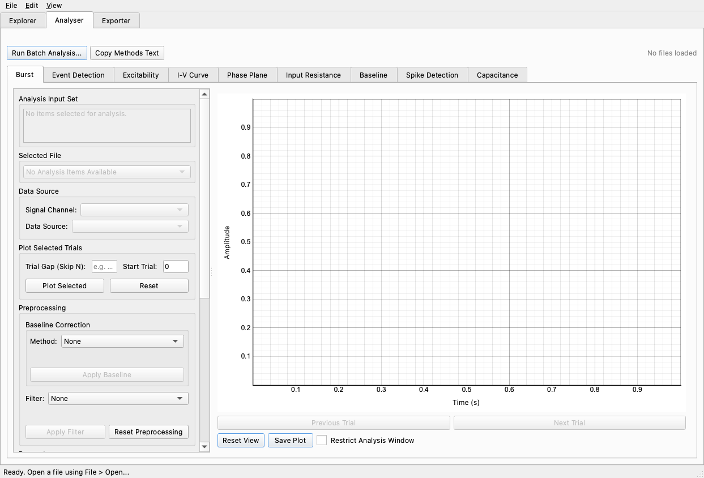
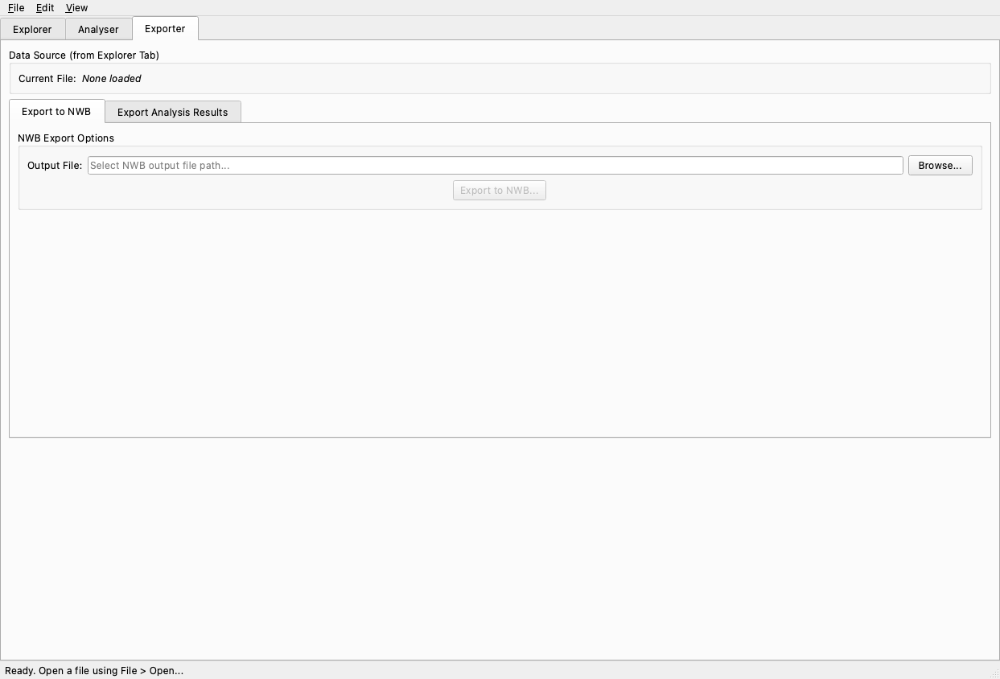

# Synaptipy User Tutorial and Documentation

Synaptipy is a robust tool for analyzing and visualizing electrophysiology data. This document serves as an automated tutorial, explaining the user interface, buttons, and the mathematical details under the hood.

## 1. The Explorer Tab

The Explorer tab is where you load and initially inspect your data files (like `.abf` or `.h5` files). 

### UI Elements & Buttons:
- **Load Directory / Add Files**: Prompts a file dialog to open recording files. It loads the initial file and scans the directory for sibling files for quick navigation.
- **Trial Navigation (Prev/Next)**: If the recording consists of multiple sweeps (trials), these buttons let you flip through them.
- **Channel Selection Dropdown**: Selects which channel (e.g. Voltage or Current) is displayed on the main plot.
- **"Add to Analysis" Button**: Pushes the currently viewed trial or the entire file into the Analyser tab queue for further processing.
- **Signal Preprocessing Tools**:
    - **Baseline Subtraction**: Uses moving average or median filtering to remove slow drift from the signal.
    - **Lowpass / Highpass Filters**: Applies standard digital Butterworth filters (`scipy.signal.butter`) to remove high-frequency noise or low-frequency drift. 
    - **Notch Filter**: Uses a digital IIR notch filter to remove specific frequencies like 50Hz/60Hz AC line noise.

---

## 2. The Analyser Tab

The Analyser tab is the core engine where different scientific features are extracted from the signals.

### UI Elements & Buttons:
- **Run Batch Analysis**: Opens a dialog to apply the same analysis pipeline across multiple files sequentially.
- **Copy Methods Text**: Generates a reproducible methods description based on the active analysis and puts it in your clipboard.
- **Global Constraints**: Provides options to establish baseline start/end times and other parameters that propagate across all sub-tabs.
- **"Run Analysis" (in each tab)**: Executes the mathematical logic wrapped inside the feature.

### Mathematical Details by Feature:

#### A. Event Detection (mEPSC / mIPSC / Spikes)
Detects distinct events such as miniature post-synaptic currents or action potentials.
- **Thresholding (Amplitude)**: Identifies contiguous regions where the signal amplitude crosses a defined $V_{threshold}$ or $I_{threshold}$. This is performed by creating a boolean mask array `signal > threshold` and finding the zero-crossings (edges) of this mask using `numpy.diff`. 
- **Derivative Thresholding (dV/dt or dI/dt)**: Calculates the numerical derivative $\Delta y / \Delta t$ using NumPy's `gradient` function. Events are identified where the slope exceeds a specific rate (e.g., > 10 V/s). This is heavily used for Action Potential identification because the rapid rising phase is highly characteristic and less susceptible to slow baseline drift than pure amplitude thresholding.
- **Template Matching**: Computes the cross-correlation between the signal and an idealized event template. Peaks in the cross-correlation array denote matched events. The algorithm uses `scipy.signal.correlate` (often computed efficiently via FFT: $\mathcal{F}^{-1}\{\mathcal{F}\{signal\} \cdot \overline{\mathcal{F}\{template\}}\}$).

#### B. Intrinsic Properties (Current Clamp)
Extracts passive and active membrane properties from step-current injection protocols.
- **Resting Membrane Potential ($V_{rest}$)**: The median voltage observed during the pre-stimulus baseline period. Median is preferred over the mean to be robust against spontaneous spiking.
- **Input Resistance ($R_{in}$)**: Calculated via Ohm's Law $R = \Delta V / \Delta I$. It measures the magnitude of the steady-state voltage change divided by the amplitude of the injected current step. The steady-state voltage is often computed as the mean voltage during the final 100ms of the current step.
- **Membrane Time Constant ($\tau$)**: Fits the voltage decay following a hyperpolarizing current step to a mono-exponential decay function: $V(t) = A \cdot e^{-t/\tau} + C$. The optimization utilizes non-linear least squares (`scipy.optimize.curve_fit`) to find the best $\tau$ that describes how quickly the cell's membrane capacitance charges.
- **Sag Ratio**: Measures hyperpolarization-activated cyclic nucleotide-gated ($I_h$) currents that resist hyperpolarization. Calculated as ratio $(V_{peak} - V_{steady}) / (V_{peak} - V_{rest})$, representing the proportion of the initial voltage deflection that is compensated for over time by the $I_h$ current activation.

#### C. Short-Term Plasticity (STP)
Analyzes paired-pulse or multi-pulse facilitation/depression.
- **Paired-Pulse Ratio (PPR)**: The ratio of the amplitude of the second response ($A_2$) to the first response ($A_1$): $PPR = A_2 / A_1$. A ratio > 1 implies facilitation (increased presynaptic calcium or mobilization), and < 1 implies depression (vesicle depletion).
- To compute accurate amplitudes, the software dynamically searches for a local baseline immediately preceding each stimulus artifact, subtracting this local offset so that temporal summation does not artificially inflate subsequent peak measurements.

---

## 3. The Exporter Tab

This tab handles converting data and analysis results into shareable formats.

### UI Elements & Buttons:
- **Export to NWB**: Packages the raw traces, metadata, and extracted features into the Neurodata Without Borders (.nwb) format, which is the standard for electrophysiology data sharing.
- **Export to CSV/Excel**: Dumps tabular result summaries (like peak times, amplitudes, and intrinsic metrics) into standard spreadsheet formats for statistical testing in external software.
- **Save Plot**: Renders the current view of the traces into high-resolution standard image formats (PNG/PDF) suitable for publications.
