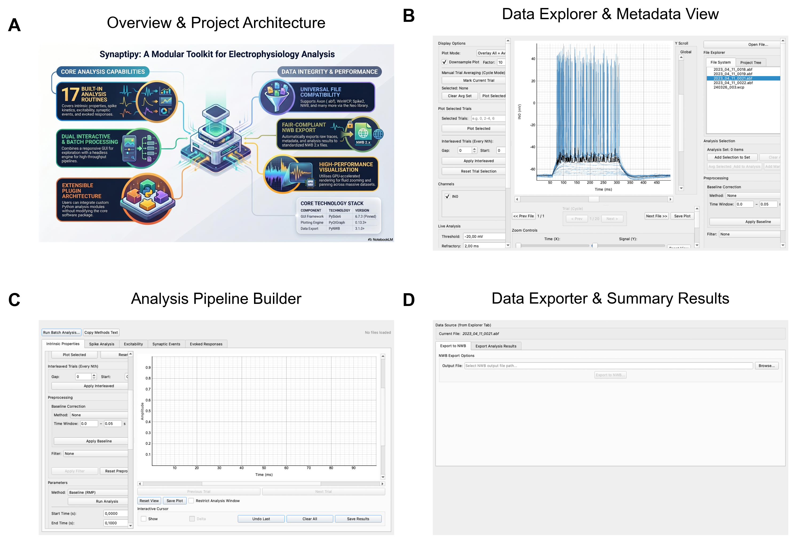
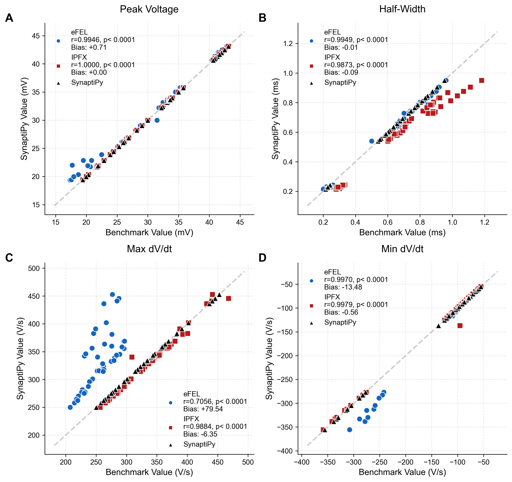
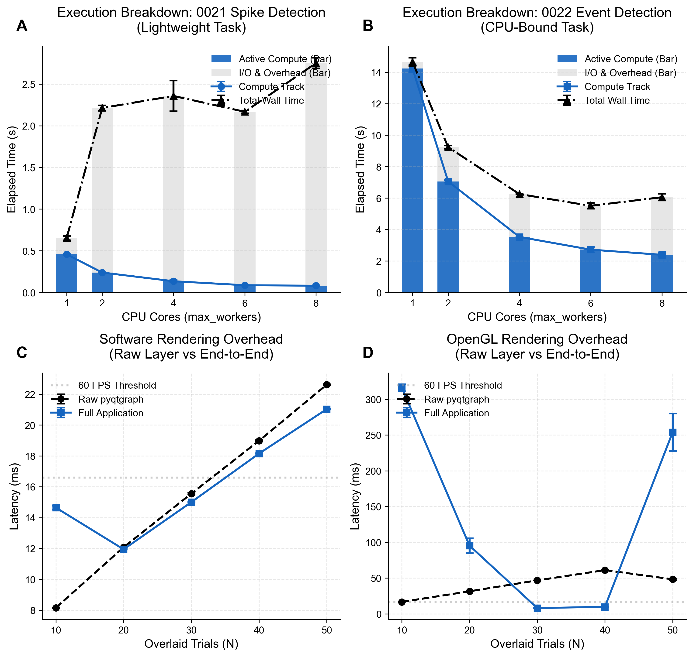

# Abstract
SynaptiPy is an open-source, all-in-one Python software suite developed for the visualization and automated analysis of intracellular electrophysiology data. It addresses the methodological divide between inflexible proprietary software and complex programmatic libraries by providing a responsive PyQt-based graphical user interface (GUI). Distributed across three major operating systems (macOS, Windows, Linux) via standard installation modes (`pip`, `conda`, and source), SynaptiPy natively incorporates broad amplifier-agnostic data parsing (e.g., Axon ABF, HEKA, CED) via the `neo` library [(Garcia et al., 2014)](#ref-garcia_neo_2014). This multi-format compatibility allows diverse research groups to standardize their analytical pipelines regardless of the equipment used. Furthermore, SynaptiPy introduces a metadata-driven plugin architecture that enables researchers to integrate custom algorithms as interactive GUI modules, effectively bridging the gap between exploratory visual inspection and headless batch processing.

# Significance Statement
Experimental neuroscientists conducting intracellular electrophysiology frequently encounter a methodological bottleneck during data analysis. They must often choose between restrictive proprietary GUI applications that lack automated batching, and complex programmatic libraries that require advanced coding expertise without interactive visual validation. SynaptiPy addresses this gap by delivering a unified analytical environment. Built on a universal Python foundation and tested across cross-platform environments, it allows researchers to execute identical analyses reproducibly. Its broad native multi-format support enables laboratories to standardize protocols, eliminating data silos created by proprietary amplifier formats.

# Introduction
The automated analysis of electrophysiological data has a rich history of foundational tools that have vastly simplified researchers' workflows. Commercial suites such as **pClamp (Clampfit)** and **Axograph** established the gold standard for reliable visual inspection. Concurrently, community-driven environments like **Neuromatic** [(Rothman & Silver, 2018)](#ref-neuromatic) provided researchers with immense algorithmic extensibility within Igor Pro, while modern open-source applications like **Stimfit** [(Guzman et al., 2014)](#ref-guzman_stimfit_2014) and **EasyElectrophysiology** brought sophisticated analytics to standalone desktop environments.

However, as the field increasingly adopts open-source Python data science ecosystems, a methodological friction has emerged. Researchers often face a difficult transition between these established graphical applications and headless Python libraries. The latter typically require advanced scripting expertise and often break the interactive visual validation loop that experimentalists rely upon.

SynaptiPy was designed specifically for experimentalists to address these limitations by prioritizing three core pillars: cross-platform accessibility, amplifier-agnostic data parsing, and decoupled plugin extensibility. First, by deploying across macOS, Windows, and Linux, the suite provides stability that allows users to perform identical analyses across different local hardware. Second, by parsing dozens of proprietary file formats natively, it enables multi-lab collaborations to standardize pipelines regardless of underlying amplifier hardware. Finally, driven by a centralized `@AnalysisRegistry`, it allows users to convert standard Python functions into interactive GUI modules. SynaptiPy ensures that interactive GUI configurations and headless batch scripts share the exact same analytical code path.

# Materials and Methods

## Experimental Design and Statistical Analysis
To quantify algorithmic reliability, SynaptiPy's extraction metrics were validated against standardized intracellular waveforms retrieved from the Allen Institute Cell Types Database. The automated pipeline targeted an initial cohort of $n = 10$ adult male and female mouse cortical cells. From this cohort, $n = 6$ cells that survived strict biological fit-quality gates (e.g., $R^2 \geq 0.80$ for exponential fits) across both hyperpolarizing and depolarizing current steps were utilized for final benchmarking. 

## Metadata-Driven Plugin Architecture
To maximize long-term extensibility, SynaptiPy utilizes a decoupled, metadata-driven architecture. Rather than utilizing hard-coded user interfaces for individual analytical functions, the software employs a centralized `@AnalysisRegistry`. Researchers can implement custom algorithms via standard Python functions. By passing explicit keyword arguments (e.g., `ui_params`) into the registration decorator, researchers define the parameter bounds and data types, which the application then dynamically maps to corresponding PyQt frontend widgets (e.g., `SpinBox`, `ComboBox`).

*Figure 1: SynaptiPy architectural data flow and graphical user interface. **(A)** Conceptual overview detailing the core capabilities of SynaptiPy, highlighting cross-platform python batch processing and a metadata-driven extensible plugin architecture. **(B)** The primary Explorer interface. Users navigate hierarchical file systems (left) and visually inspect raw electrophysiological traces (center), demonstrating interactive sweep selection and plotting. **(C)** The Analysis interface showcasing an intrinsic properties analysis workflow. **(D)** The batch export module.*

## Multi-Format Parsing and GUI-to-Batch Parameter Serialization
SynaptiPy relies on the `neo` backend to execute binary file parsing for proprietary hardware files. Interactive parameter adjustments made in the GUI are fully reproducible in the headless `BatchAnalysisEngine`. Every analysis widget maps to a named entry in the `ui_params` list. When the user saves a session, these parameters are serialized to JSON. The `BatchAnalysisEngine` accepts this identical dictionary format, ensuring that a batch result is mathematically equivalent to the GUI result.

## Code Accessibility
SynaptiPy is an open-source tool licensed under the GNU Affero General Public License v3.0 (AGPL-3.0). For the purpose of double-blind review, the repository has been mirrored anonymously at `https://anonymous.4open.science/r/synaptipy-blind/`. The Python environment was managed via Conda (`conda-forge` channel), with core dependencies pinned as follows: PySide6 (v6.7.3) [(The Qt Company, 2023)](#ref-qt_pyside6), PyQtGraph (v0.13.7) [(Campagnola and others, 2024)](#ref-campagnola_pyqtgraph), Neo (v0.14.4) [(Garcia et al., 2014)](#ref-garcia_neo_2014), NumPy (v2.0.2) [(Harris et al., 2020)](#ref-harris_numpy_2020), SciPy (v1.17.1) [(Virtanen et al., 2020)](#ref-virtanen_scipy_2020), and Pandas (v3.0.2) [(McKinney, 2010)](#ref-mckinney_pandas_2010).

# Results

## Handling Experimental Noise and Baseline Estimation
For dynamic baseline estimations, the synaptic event detection algorithms utilize localized detrending via a rolling median filter across the target epoch. To determine accurate detection thresholds, the algorithm isolates a minimum-variance sliding window to calculate a quiescent root-mean-square (RMS) noise floor. This approach mathematically isolates random high-frequency thermal noise from slow biological baseline drift, ensuring detection thresholds remain highly robust across variable experimental conditions.

## Algorithmic Parity against Computational Benchmarks
SynaptiPy successfully processed the targeted datasets via the `BatchAnalysisEngine`, resolving primary active and passive properties. To validate these extractions, the results were statistically compared against two established computational field standards: the Electrophysiology Feature Extraction Library (eFEL) [(Mandge et al., 2026)](#ref-efel) and the Allen Institute's Intrinsic Physiology Feature Extractor (IPFX) [(Gouwens et al., 2020)](#ref-ipfx). 

For active properties, SynaptiPy utilized a standard dynamic derivative-crossing threshold ($dV/dt > 20$ V/s). The resulting measurements for action potential onset, amplitudes, and phase-plane dynamics demonstrated strong agreement with both libraries (Table 1, Figure 2). For subthreshold passive properties, SynaptiPy exhibited robust steady-state Input Resistance and Resting Membrane Potential estimations, aligning closely with standard reference values (Table 2).

<!-- TABLES_START -->

**Extended Data Table 1: Statistical summary of SynaptiPy AP extraction vs. eFEL and IPFX benchmarks (Allen Dataset, per-sweep means).**

| Metric | SynaptiPy vs IPFX Pearson *r* | SynaptiPy vs eFEL Pearson *r* | Mean bias vs IPFX | Mean bias vs eFEL |
|--------|-------------------------------|-------------------------------|-------------------|-------------------|
| AP threshold (mV) | 0.9277*** | 0.9330*** | +0.052 mV | +0.001 mV |
| AP amplitude (mV) | 0.9952*** | 0.9902*** | -0.052 mV | +0.706 mV |
| AP half-width (ms) | 0.9873*** | 0.9949*** | -0.094 ms | -0.012 ms |
| Max dV/dt (V/s) | 0.9884*** | 0.7056*** | -6.352 V/s | +79.539 V/s |
| AP Delay (Time to first spike) (ms) | 1.0000*** | 1.0000*** | -0.000 ms | -0.002 ms |
| Upstroke/Downstroke Ratio | 0.9998*** | 0.9971*** | -0.070 Ratio | +0.519 Ratio |
| Fast AHP depth (mV) | 0.9807*** | 0.9513*** | +0.725 mV | -1.884 mV |
| ADP amplitude (mV) | -0.3867 (*p*=0.5203) | 0.5881*** | -6.561 mV | +2.929 mV |
| Mean Firing Frequency (Hz) | 1.0000*** | 0.5951*** | +0.000 Hz | +23.921 Hz |
| Spike Frequency Adaptation | 1.0000*** | 0.7569*** | -0.000 Ratio | +0.014 Ratio |

*Statistical approaches: All correlations are Pearson's r (two-sided). *** denotes p < 0.0001. Data reflects n = 43 sweeps (unless otherwise missing/rejected) where pipelines detected ≥1 action potential. Bias = mean signed difference (SynaptiPy − benchmark, per-sweep means). SynaptiPy: BatchAnalysisEngine `spike_detection` (dV/dt threshold 20 V/s, refractory 2 ms). eFEL: BlueBrain eFEL defaults. IPFX: Allen IPFX SpikeFeatureExtractor, 9.9 kHz Bessel filter. N/A = no direct benchmark equivalent.*

**Extended Data Table 2: Subthreshold passive properties benchmark on hyperpolarizing steps (Allen Dataset).**

| Metric | Valid *N* | SynaptiPy vs eFEL Pearson *r* | Mean bias vs eFEL | LoA vs eFEL | SynaptiPy vs IPFX Pearson *r* | Mean bias vs IPFX | LoA vs IPFX |
|--------|-----------|-------------------------------|-------------------|-------------|-------------------------------|-------------------|-------------|
| Resting Membrane Potential (mV) | 34 | 0.9825*** | -2.224 mV | [-3.06, -1.39] mV | 0.9999*** | -0.125 mV | [-0.18, -0.06] mV |
| Input Resistance — Steady-State (MΩ) † | 34 | 0.9995*** | +0.258 MΩ | [-2.76, +3.28] MΩ | N/A | N/A | N/A |
| Input Resistance — Peak (MΩ) ‡ | 34 | N/A | N/A | N/A | 0.5065 (*p*=0.0022) | -6.561 MΩ | [-126.09, +112.97] MΩ |
| Membrane Time Constant (ms) | 34 | 0.2547 (*p*=0.1461) | -18.485 ms | [-92.86, +55.89] ms | 0.9013 (*p*=0.0056) | -2.126 ms | [-10.43, +6.17] ms |
| Sag Percentage (%) | 34 | -0.9894*** | -87.285 % | [-109.62, -64.95] % | 0.9558*** | +3.820 % | [-2.96, +10.60] % |

*All correlations are Pearson's r (two-sided); *** = p < 0.0001. LoA = 95% Bland-Altman limits of agreement (mean ± 1.96 SD of sweep-level differences). † SS-Rin: mean voltage in last 100 ms of step (matches eFEL ohmic_input_resistance). ‡ Peak-Rin: maximum hyperpolarization deflection (matches IPFX voltage_deflection). N/A = no direct benchmark equivalent.*
<!-- TABLES_END -->

*Figure 2: Biological validation and algorithmic parity against established computational benchmarks. Scatter plots comparing SynaptiPy extractions against eFEL (blue circles) and IPFX (red squares) for core action potential metrics. The black triangles represent SynaptiPy plotted against itself to explicitly indicate the unity line of perfect agreement. Pearson correlation ($r$) and Mean Bias are provided for reference.*

## Biological Use-Case Demonstration
Beyond standalone mathematical validation, SynaptiPy offers immediate utility for experimental workflows (Figure 3). End-to-end benchmarking indicates that the software maintains stable execution times even as recording complexity scales. In headless batch mode, core spike detection completes in approximately 68.5 ms per multi-sweep recording, allowing high-throughput processing across multiple CPU cores (Figure 3A). Furthermore, under software rendering, the full end-to-end application loop remains responsive, ranging from 14 to 18 ms for 10 to 20 overlaid trials (Figure 3C). 

*Figure 3: Computational performance and rendering benchmarks. **(A, B)** CPU scaling performance for batch processing using the `BatchAnalysisEngine` across lightweight (spike detection) and intensive (event detection) tasks. **(C, D)** Rendering latency scaling for dense trial overlays under software and OpenGL acceleration modes, demonstrating interactive responsiveness under typical experimental loads.*

# Discussion
Within the current landscape of intracellular electrophysiology software, SynaptiPy provides a unified analytical utility explicitly tailored to experimental workflows. It is not intended to replace the deep, highly specialized functionality of established suites like **Neuromatic** or **EasyElectrophysiology**, but rather to serve as a complementary bridge into the Python ecosystem.

While software packages like **Clampfit** and **Axograph** remain incredibly robust industry standards, their proprietary formats and platform dependencies can create friction in multi-lab collaborations spanning macOS and Linux. By combining the interactive GUI experience of tools like **Stimfit** with a pure Python backend, SynaptiPy allows researchers to sync their analysis protocols using a universal standard (Table 3).

**Table 3: Feature comparison of SynaptiPy against prominent electrophysiology tools.**

| Feature | SynaptiPy | Clampfit | Stimfit | Neuromatic (Igor) | EasyElectrophysiology |
| :--- | :--- | :--- | :--- | :--- | :--- |
| **Interactive GUI** | Yes | Yes | Yes | Yes | Yes |
| **Batch Engine** | Yes (Python) | Limited | Yes (Python/C++) | Yes (Igor Pro) | Limited |
| **Multi-Format Loading** | Yes | No | Yes | Limited | Yes |
| **OS Compatibility** | Win, macOS, Linux | Win | Win, macOS, Linux | Win, macOS | Win, macOS, Linux |

**Limitations**: SynaptiPy currently focuses exclusively on *in vitro* patch-clamp and optogenetic datasets. It does not implement clustering or spike-train heuristics for *in vivo* extracellular multi-electrode arrays (MEAs), a domain already expertly served by broader Python ecosystem libraries such as **Elephant** and **Pynapple**. We actively invite the open-source community to leverage the decoupled `@AnalysisRegistry` to expand these functionalities.

# References
- Garcia S, Guarino D, Jaillet F, Jennings T, Grün S, Davison AP (2014) Neo: An Object Model for Handling Electrophysiology Data in Multiple Formats. *Frontiers in Neuroinformatics* 8:10. https://doi.org/10.3389/fninf.2014.00010
- Virtanen P, Gommers R, Oliphant TE, Haberland M, Reddy T, Cournapeau D, Burovski E, Peterson P, Weckesser W, Bright J, {van der Walt} SJ, Brett M, Wilson J, Millman KJ, Mayorov N, Nelson ARJ, Jones E, Kern R, Larson E, Carey CJ, Polat I, Feng Y, Moore EW, VanderPlas J, Laxalde D, Perktold J, Cimrman R, Henriksen I, Quintero EA, Harris CR, Archibald AM, Ribeiro AH, Pedregosa F, {van Mulbregt} P (2020) SciPy 1.0: Fundamental Algorithms for Scientific Computing in Python. *Nature Methods* 17:261--272. https://doi.org/10.1038/s41592-019-0686-2
- Harris CR, Millman KJ, {van der Walt} SJ, Gommers R, Virtanen P, Cournapeau D, Wieser E, Taylor J, Berg S, Smith NJ, Kern R, Picus M, Hoyer S, {van Kerkwijk} MH, Brett M, Haldane A, {del Río} JF, Wiebe M, Peterson P, Gérard-Marchant P, Sheppard K, Reddy T, Weckesser W, Abbasi H, Gohlke C, Oliphant TE (2020) Array Programming with NumPy. *Nature* 585:357--362. https://doi.org/10.1038/s41586-020-2649-2
- The Qt Company (2023) Qt for Python (PySide6). https://doc.qt.io/qtforpython/
- Campagnola L, others (2024) PyQtGraph: Scientific Graphics and GUI Library for Python. http://www.pyqtgraph.org/
- McKinney W (2010) Data Structures for Statistical Computing in Python. *Proceedings of the 9th Python in Science Conference*. https://doi.org/10.25080/Majora-92bf1922-00a
- Guzman SJN, Schlögl A, Schmidt-Hieber C (2014) Stimfit: Quantifying Electrophysiological Data with Python. *Frontiers in Neuroinformatics* 8:16. https://doi.org/10.3389/fninf.2014.00016
- Rothman JS, Silver RA (2018) NeuroMatic: An Integrated Open-Source Software Toolkit for Acquisition, Analysis and Simulation of Electrophysiological Data. *Frontiers in Neuroinformatics* 12:14. https://doi.org/10.3389/fninf.2018.00014
- Blue Brain Project (2024) Electrophysiology Feature Extraction Library (eFEL). https://github.com/BlueBrain/eFEL
- Gouwens NW, Berg J, Feng D, Sorensen SA, Zeng H, Hawrylycz MJ, Koch C, Arkhipov A (2020) Intrinsic Physiology Feature Extractor (IPFX). https://github.com/AllenInstitute/ipfx