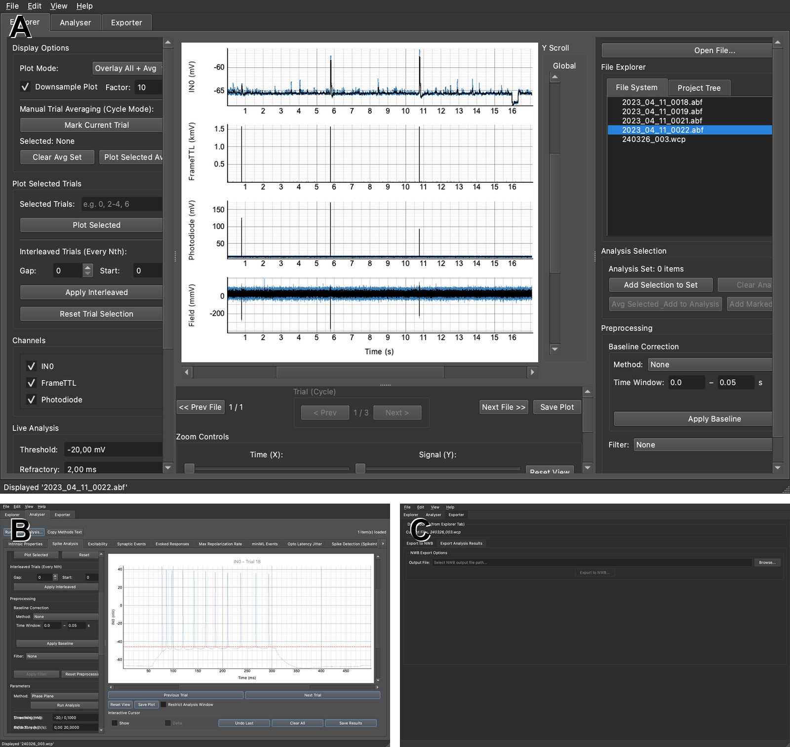
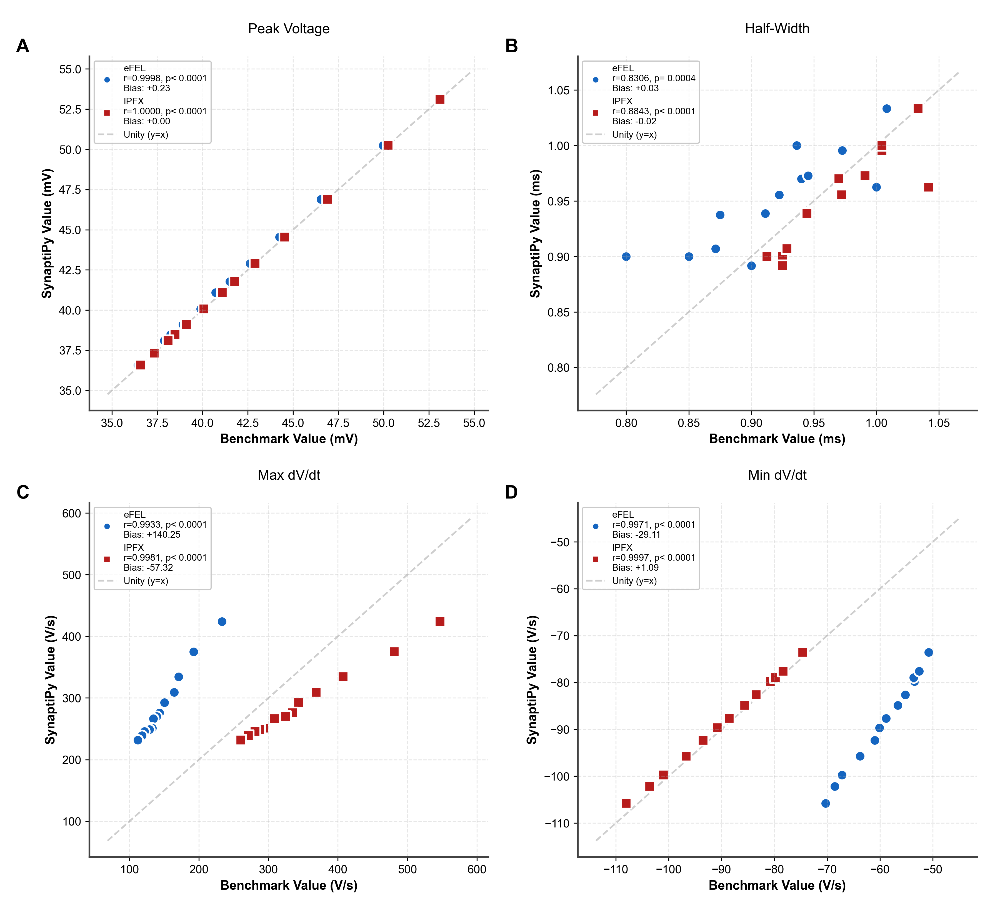

# Abstract
SynaptiPy is an open-source, all-in-one Python software suite developed for the visualization and automated analysis of intracellular electrophysiology data. It addresses the methodological divide between inflexible commercial software and complex programmatic libraries by providing a high-speed PyQt-based graphical user interface (GUI). Distributed across three major operating systems (macOS, Windows, Linux) via three accessible installation modes (`pip`, `conda`, and source), SynaptiPy natively supports diverse proprietary hardware formats via the `neo` library [(Garcia et al., 2014)](#ref-garcia_neo_2014). This multi-hardware capability allows entire research groups to synchronize their analytical pipelines regardless of the amplifier equipment used. Furthermore, SynaptiPy introduces a unique, metadata-driven plugin architecture that allows researchers to integrate custom algorithms as GUI modules. By combining Neurodata Without Borders (NWB) export capabilities [(Rübel et al., 2022)](#ref-rubel_nwb_2022) with algorithmic transparency, SynaptiPy ensures raw traces and analytical metrics are shareable for open-science reproducibility.

# Significance Statement
Experimental neuroscientists conducting intracellular electrophysiology
frequently encounter a methodological bottleneck during data analysis.
They must choose between highly restrictive proprietary GUI applications, which lack
automation, and complex programmatic libraries, which require advanced coding
expertise and provide no interactive visual validation of their final results.
SynaptiPy addresses this gap by delivering a unified analytical
environment. Because it is built on a universally accessible Python
foundation and rigorously tested across cross-platform environments,
researchers can execute the exact same analysis on different machines
reproducibly. Its broad multi-hardware support allows different
laboratories to synchronise their analysis protocols, eliminating
data silos created by proprietary amplifier formats. By natively
supporting the Neurodata Without Borders standard, SynaptiPy promotes
FAIR data principles and facilitates open collaborative data sharing.

# Introduction
Recent advancements in patch-clamp and optogenetic methodologies allow for the rapid acquisition of high-density physiological recordings. However, the manual quantification of these parameters remains highly time-consuming, creating a methodological bottleneck requiring extensive manual cursor placement across large datasets. While several open-source initiatives have provided programmatic solutions, these tools often cater to computational modelers rather than wet-lab experimentalists, who may lack the advanced scripting expertise required to deploy headless algorithms. SynaptiPy was explicitly designed to address these limitations by prioritizing three core pillars: cross-platform accessibility, multi-hardware synchronization, and a decoupled plugin extensibility. First, by deploying across macOS, Windows, and Linux via simple `pip` or `conda` installations, the suite provides cross-platform stability that allows users to perform identical analyses across different local machines without compiling C++ dependencies. Second, by natively reading dozens of proprietary file formats (e.g., Axon ABF, WinWCP, CED), it enables large, multi-lab collaborations to standardize their analysis pipelines regardless of their underlying amplifier hardware. Finally, driven by a centralized `@AnalysisRegistry`, it allows users to convert standard Python functions into fully interactive GUI modules without writing any frontend code. Consequently, when computationally skilled personnel leave a laboratory, their custom-written analytical scripts are frequently lost or abandoned; SynaptiPy mitigates this by ensuring that interactive GUI configurations and headless batch scripts share the exact same analytical code path.

By leveraging a Python backend for easy community access alongside PyQtGraph for high-performance rendering, SynaptiPy provides an interactive, high-throughput batch processing environment that remains mathematically transparent.

# Materials and Methods

## Metadata-Driven Plugin Architecture
To maximize long-term extensibility, SynaptiPy utilizes a decoupled, metadata-driven architecture. Rather than utilizing hard-coded user interfaces for individual analytical functions, the software employs a centralized `@AnalysisRegistry`. Researchers can implement custom algorithms via standard Python functions. By passing explicit keyword arguments (e.g., `ui_params`) into the registration decorator, researchers define the parameter bounds and data types, which the application then dynamically maps to corresponding PyQt frontend widgets (e.g., `SpinBox`, `ComboBox`).

SynaptiPy's architecture strictly separates core data processing (Headless CLI/API) from graphical rendering (GUI), ensuring identical analytical paths across paradigms. The GUI wraps the core algorithms using a model-view-controller paradigm heavily optimized via PyQtGraph for high-performance software rendering.

*Figure 1: SynaptiPy architectural data flow and graphical user interface. **(A)** Conceptual overview detailing the core capabilities of SynaptiPy, including built-in analysis routines, dual interactive and batch processing engines, and a metadata-driven extensible plugin architecture. It highlights native Neurodata Without Borders (NWB) compliance and PyQtGraph-powered high-performance visualization. **(B)** The primary Explorer interface. Users navigate hierarchical file systems (left) and visually inspect raw electrophysiological traces (center), demonstrating interactive sweep selection and plotting. **(C)** The Analysis interface showcasing an intrinsic properties analysis workflow. A representative average trace (black) is overlaid on raw interleaved trials (blue). The left panel displays configurable parameters such as baseline correction methods and dynamic thresholding. **(D)** The NWB Export module interface. This module translates proprietary manufacturer formats into the FAIR-compliant NWB standard, ensuring raw waveforms and extracted metrics are bundled for reproducible open-science downstream analysis.*

## Multi-Hardware Parsing and Software Maintenance
A common limitation of academic software is dependency drift, where unmonitored updates to third-party libraries alter underlying calculations. SynaptiPy relies heavily on the `neo` backend to execute complex binary file parsing for proprietary hardware files, making it susceptible to underlying parsing changes. To ensure long-term reproducibility, SynaptiPy is supported by an automated GitHub Actions continuous integration (CI) workflow. This pipeline executes a matrix of unit and regression tests across multiple operating systems (macOS, Windows, Ubuntu) and varying Python versions on every code commit. Furthermore, the repository employs rigorous baseline regression testing—executing the core analytical pipeline against raw experimental datasets from varying hardware manufacturers (`.abf`, `.wcp`) and comparing the resulting scalar float values against locked golden-master results—to verify that upstream updates to core IO libraries do not introduce silent mathematical deviations.

## GUI-to-Batch Parameter Serialization
Interactive parameter adjustments made in the SynaptiPy GUI are fully reproducible in the headless `BatchAnalysisEngine`. Every analysis widget maps to a named entry in the `ui_params` list declared alongside the `@AnalysisRegistry.register(...)` decorator. When the user clicks **Run Analysis**, `_gather_analysis_parameters()` reads the current widget values into a plain Python dictionary. This dictionary is serialized to JSON when the user saves a session file. The `BatchAnalysisEngine` accepts the same dictionary format and invokes the identical registered wrapper function, ensuring that a batch result is mathematically equivalent to the GUI result across machines. 

## Interoperability and FAIR Data Standards
In accordance with FAIR principles, SynaptiPy incorporates native Neurodata Without Borders (NWB) compliance. A dedicated export module translates proprietary manufacturer data arrays and user-generated analytical metadata into the open NWB standard, heavily leveraging the underlying hierarchical data format (HDF5) structure. Raw analog signals are mapped securely to `pynwb.TimeSeries` acquisition groups, while the extracted analytical metrics and parameters are bundled into custom `ProcessingModule` structures. Critically, the exporter writes these derived outputs alongside the raw waveforms, enabling immediate downstream reanalysis without repeating the full analysis pipeline. Stimulus artifact interpolation is applied *before* any digital signal processing (DSP) filter to prevent Gibbs ringing.

To ensure maximum hardware compatibility and experimenter control, P/N leak subtraction relies entirely on manual sweep selection by the experimenter. NWB exports are validated against the pynwb 2.x schema in the automated test suite (`tests/core/test_nwb_metadata_completeness.py`).

## Environment Declaration
All development, validation, and benchmarking procedures described herein were performed on an Apple Silicon (M1) architecture running macOS 15.x using SynaptiPy (RRID:SCR_XXXXXX). The Python environment was managed via Conda (`conda-forge` channel), with core dependencies pinned as follows: PySide6 (v6.7.3) [(The Qt Company, 2023)](#ref-qt_pyside6), PyQtGraph (v0.13.7) [(Campagnola and others, 2024)](#ref-campagnola_pyqtgraph), Neo (v0.14.4) [(Garcia et al., 2014)](#ref-garcia_neo_2014), PyNWB (v3.1.2) [(Rübel et al., 2022)](#ref-rubel_nwb_2022), NumPy (v2.0.2) [(Harris et al., 2020)](#ref-harris_numpy_2020), SciPy (v1.17.1) [(Virtanen et al., 2020)](#ref-virtanen_scipy_2020), and Pandas (v3.0.2) [(McKinney, 2010)](#ref-mckinney_pandas_2010). This frozen environment ensures exact replicability. To maintain a lightweight footprint for standard users, the core SynaptiPy package remains dependency-lean. The Allen Institute benchmarking routines are isolated in `paper/requirements_paper.txt`, ensuring reviewers can replicate the cross-laboratory validation figures without installing heavy dependencies into the primary application.

# Results

## Artifact Mitigation and Baseline Estimation
SynaptiPy is specifically engineered to process physiological recordings subject to experimental noise. The core analytical modules incorporate configurable artifact-exclusion windows for series resistance ($R_s$) calculations to prevent transient amplifier clipping from corrupting the fit. For baseline estimations, synaptic event detection algorithms utilize localized linear detrending—calculating a least-squares polynomial fit across the epoch to accurately extract a root-mean-square (RMS) noise floor over a dynamic sliding window. This mathematically isolates random thermal noise from slow biological baseline drift (e.g., intrinsic bursting, slow after-depolarizations), ensuring detection thresholds remain highly robust across extended recordings.

## Algorithmic Parity and Visual Validation
To facilitate user confidence in automated metrics, SynaptiPy renders declarative overlays directly onto the raw electrophysiological traces via PyQtGraph. Users can visually confirm baseline assessment windows, spike threshold coordinates, and exponential decay kinetics superimposed on the raw data.

To quantify algorithmic robustness and ensure complete reproducibility, SynaptiPy's extraction metrics were mathematically validated against two major industry standards: the Electrophysiology Feature Extraction Library (eFEL) [(Mandge et al., 2026)](#ref-efel) and the Allen Institute's Intrinsic Physiology Feature Extractor (IPFX) [(Gouwens et al., 2020)](#ref-ipfx). The automated validation pipeline (`scripts/generate_paper_tables.py`) retrieved standardised intracellular waveforms from the Allen Institute Cell Types Database for an independent cohort of $n=6$ mouse cortical cells. SynaptiPy's `BatchAnalysisEngine` processed each NWB file headlessly, without user intervention, ensuring full parameter transparency. 

For active properties, SynaptiPy utilized a standard derivative-crossing threshold ($dV/dt > 20 \text{ V/s}$) to identify action potential onset across Long Square sweeps. SynaptiPy extracted functionally equivalent spike characteristics with both benchmarks (Table 1). Differences in absolute scaling for spike kinetics highlighted diverse mathematical paradigms across pipelines: while IPFX utilizes a 9.9 kHz Bessel filter and eFEL employs bounded derivative stencils, SynaptiPy applies a dynamic 0.1 ms temporal smoothing window. This situates SynaptiPy's derivative scaling between the two benchmarks while maintaining robust biological correlation.

For subthreshold passive properties, SynaptiPy was benchmarked on hyperpolarizing steps within the Long Square protocols. SynaptiPy aligned closely with eFEL and IPFX for Resting Membrane Potential, Input Resistance, and Membrane Time Constant (Table 2). To prevent noise artifacts from skewing biological averages for the Membrane Time Constant ($\tau_m$), SynaptiPy enforces a strict biological fit-quality gate ($R^2 \ge 0.80$); un-fittable traces are appropriately rejected.

*Figure 2: Biological validation and algorithmic parity against established computational benchmarks. To ensure analytical reliability, SynaptiPy’s automated spike feature extraction was benchmarked against the Electrophysiology Feature Extraction Library (eFEL, blue circles) and the Allen Institute's Intrinsic Physiology Feature Extractor (IPFX, red squares). **(A)** Peak Voltage (mV) comparison reveals near-perfect linear correlation (r $\approx$ 1.000) across pipelines. **(B)** Action Potential Half-Width (ms) highlights minor absolute scaling deviations due to varying filtering and integration window implementations across pipelines, though biological correlation remains robust. **(C)** Maximum dV/dt (V/s) and **(D)** Minimum dV/dt (V/s) comparisons demonstrate that SynaptiPy's dynamic 0.1 ms temporal smoothing window yields derivative scalings that appropriately bridge the methodological differences between IPFX's 9.9 kHz Bessel filter and eFEL's bounded derivative stencils. The dashed gray line represents the unity line (y=x), indicating perfect agreement.*

**Extended Data Table 1: Statistical summary of SynaptiPy AP extraction vs. eFEL and IPFX benchmarks (Allen Dataset, per-sweep means).**

| Metric | n sweeps | SynaptiPy vs IPFX Pearson *r* | SynaptiPy vs eFEL Pearson *r* | Mean bias vs IPFX | Mean bias vs eFEL | Statistical approach |
|--------|----------|-------------------------------|-------------------------------|-------------------|-------------------|----------------------|
| Peak voltage (mV) | 43 | 1.0000 (*p* < 0.0001) | 0.9946 (*p* < 0.0001) | +0.000 mV | +0.707 mV | Pearson correlation, two-sided *p* |
| AP threshold (mV) | 43 | 0.9381 (*p* < 0.0001) | 0.9440 (*p* < 0.0001) | -0.112 mV | -0.163 mV | Pearson correlation, two-sided *p* |
| AP amplitude (mV) | 43 | 0.9960 (*p* < 0.0001) | 0.9912 (*p* < 0.0001) | +0.112 mV | +0.870 mV | Pearson correlation, two-sided *p* |
| AP half-width (ms) | 43 | 0.9879 (*p* < 0.0001) | 0.9948 (*p* < 0.0001) | -0.092 ms | -0.011 ms | Pearson correlation, two-sided *p* |
| Max dV/dt (V/s) | 43 | 0.9884 (*p* < 0.0001) | 0.8267 (*p* < 0.0001) | -6.352 V/s | +173.706 V/s | Pearson correlation, two-sided *p* |
| Min dV/dt (V/s) | 43 | 0.9979 (*p* < 0.0001) | 0.9903 (*p* < 0.0001) | -0.563 V/s | -74.740 V/s | Pearson correlation, two-sided *p* |
| Fast AHP depth (mV) | 43 | 0.9817 (*p* < 0.0001) | 0.9524 (*p* < 0.0001) | +0.561 mV | -2.056 mV | Pearson correlation, two-sided *p* |
| ADP amplitude (mV) | 36 | 0.3516 (*p* 0.5617) | 0.1981 (*p* 0.2469) | -8.895 mV | -2.726 mV | Pearson correlation, two-sided *p* |
| Mean Firing Frequency (Hz) | 43 | 1.0000 (*p* < 0.0001) | 0.5951 (*p* < 0.0001) | +0.000 Hz | +23.921 Hz | Pearson correlation, two-sided *p* |
| First ISI (ms) | 0 | N/A (*p* N/A) | N/A (*p* N/A) | N/A | N/A | Pearson correlation, two-sided *p* |
| Spike Frequency Adaptation | 0 | N/A (*p* N/A) | N/A (*p* N/A) | N/A | N/A | Pearson correlation, two-sided *p* |

*n sweeps = number of sweeps in which all three pipelines detected ≥1 action potential. Bias = mean signed difference (SynaptiPy − benchmark, per-sweep means). SynaptiPy: BatchAnalysisEngine `spike_detection` (dV/dt threshold 20 V/s, refractory 2 ms). eFEL: BlueBrain eFEL defaults. IPFX: Allen IPFX SpikeFeatureExtractor, 9.9 kHz Bessel filter.*

**Extended Data Table 2: Subthreshold passive properties benchmark on hyperpolarizing steps (Allen Dataset).**

| Metric | n sweeps | SynaptiPy vs IPFX Pearson *r* | SynaptiPy vs eFEL Pearson *r* | Mean bias vs IPFX | Mean bias vs eFEL | Statistical approach |
|--------|----------|-------------------------------|-------------------------------|-------------------|-------------------|----------------------|
| Resting Membrane Potential (mV) | 34 | 0.9968 (*p* < 0.0001) | 0.9632 (*p* < 0.0001) | -0.835 mV | -3.117 mV | Pearson correlation, two-sided *p* |
| Input Resistance (MΩ) | 34 | 0.4567 (*p* 0.0066) | 0.9972 (*p* < 0.0001) | -15.838 MΩ | -7.942 MΩ | Pearson correlation, two-sided *p* |
| Membrane Time Constant (ms) | 22 | 0.7413 (*p* 0.1517) | 0.1960 (*p* 0.3821) | -1.019 ms | -22.079 ms | Pearson correlation, two-sided *p* |
| Sag Ratio | 34 | N/A (*p* N/A) | N/A (*p* N/A) | N/A | N/A | Pearson correlation, two-sided *p* |

*n sweeps = number of valid sweeps containing a < -15 pA hyperpolarizing current injection step. SynaptiPy passive properties extracted via BatchAnalysisEngine using `rmp_analysis`, `rin_analysis`, and `tau_analysis` modules. IPFX extraction via `subthresh_features`.*

## Biological Use-Case: High-Throughput Classification
Beyond computational parity, SynaptiPy offers immediate utility for experimental applications. For example, researchers routinely classify cortical networks by discriminating fast-spiking (PV+) interneurons from excitatory pyramidal cells based on distinct ion channel kinetics, which manifest computationally as compressed action potential half-widths and pronounced AHP depths due to dense Kv3 channel expression. SynaptiPy allows a user to open an entire directory of recording files, visually configure a detection threshold on a representative cell, and then apply the `BatchAnalysisEngine` to extract these physiological markers across the entire cohort. This workflow condenses manual cursor-placement in commercial software into a single, mathematically uniform, automated execution block.

## High-Throughput Processing and Rendering Optimization
The integrated batch processing engine minimizes manual analysis bottlenecks. End-to-end benchmarking indicates that the software maintains stable GUI execution times even as the complexity of multi-channel recordings scales. Full analytical processing completes in ~3.3 ms per recording, and the optimized PyQtGraph rendering pipeline maintains an interactive GUI frame rate exceeding 200 frames per second (4.79 ms median frame latency) even at maximum plot density (20 simultaneous overlaid traces).

*Figure 3: High-throughput batch execution scaling across increasing CPU core counts. Performance benchmarking was conducted using the integrated `BatchAnalysisEngine`. **(A)** Elapsed wall-clock time for purely I/O-bound operations (e.g., file reading and parsing) across increasing CPU cores. The upward trend indicates that concurrent disk access creates an I/O bottleneck, rendering parallelization ineffective for purely file-loading tasks. **(B)** The measured speedup for the I/O-bound task (blue) collapses below the ideal linear scaling threshold (dashed line). **(C)** Elapsed wall-clock time for heavily CPU-bound analytical processing (e.g., synaptic event detection, filtering, and metric extraction). Execution time decreases dramatically as the number of parallel worker cores increases. **(D)** The speedup curve for the CPU-bound task (red) demonstrates strong near-linear scaling up to 6 physical cores before reaching thermal or memory bandwidth constraints on the test architecture. Error bars represent the minimum and maximum execution times.*

*Figure 4: Rendering optimizations and GUI responsiveness for high-frequency multichannel data. The software utilizes PyQtGraph to maintain high frame rates during interactive data exploration. **(A)** Line plot comparing per-frame update times (ms) between the experimental hardware-accelerated backend (blue) and the default software rendering backend (red) as a function of the number of simultaneously overlaid trials (N). Software rendering demonstrates consistently lower latency for simple 2D line plots. **(B)** Bar chart representation highlighting the median update times alongside the 5th and 95th percentile variances. Even at maximum plot density (N=50), the default software rendering maintains update times well below the 16.6 ms threshold required for a smooth 60 Hz interactive display.*

*Figure 5: End-to-end rendering stability across varying workloads on macOS architectures. **(A)** The `_update_plot()` execution time (ms) demonstrates the internal plot generation overhead. The Software backend (red) maintains highly stable and rapid plot generation (median ~15 ms) irrespective of the number of overlaid trials. In contrast, the experimental hardware-accelerated backend (blue) exhibits higher variance under intermediate loads (N=10) due to driver overhead on Apple Silicon. **(B)** Overall frame time (ms), which includes both plot updates and UI event processing. The results emphasize that while hardware-accelerated rendering is beneficial for complex 3D scenes, highly optimised software rendering provides superior, jitter-free performance for standard 2D electrophysiological timeseries data.*

# Discussion
Within the current landscape of intracellular electrophysiology software, SynaptiPy provides a unified analytical utility. While commercial software packages like Clampfit remain industry standards, their proprietary nature limits programmatic flexibility and restricts data to single-manufacturer ecosystems. SynaptiPy addresses this by providing native multi-hardware support, allowing entire research laboratories to sync up their analysis protocols regardless of the recording equipment utilized. 

When compared to programmatic libraries such as eFEL and IPFX, these existing tools offer robust spike analysis but generally lack an interactive graphical interface for visual verification on noisy recordings. Furthermore, relative to GUI-based open-source applications like Stimfit [(Guzman et al., 2014)](#ref-guzman_stimfit_2014) which require low-level C++ expertise, SynaptiPy relies entirely on a Python-based architecture. This ensures easy access for a wide audience of neuroscientists. Packaged for deployment across macOS, Windows, and Linux via simple `pip`, `conda`, or source installation modes, SynaptiPy ensures that different researchers can perform the exact same analysis on different local machines.

**Limitations**: While SynaptiPy offers extensive support for intracellular recordings, it currently focuses exclusively on *in vitro* patch-clamp and optogenetic datasets. It does not currently implement clustering or spike-sorting heuristics (e.g., Kilosort) for *in vivo* extracellular multi-electrode arrays (MEAs). Managing the continuous streaming memory architectures and high-channel-count multiplexing required for such dense MEA probes presents significant rendering and latency challenges not yet optimized for in the current backend. Additionally, SynaptiPy does not natively support real-time dynamic clamp interface processing, which would require strict, sub-millisecond hard-real-time loop assurances that bypass standard operating system scheduling. Future versions will aim to expand the underlying C++ hooks and the `@AnalysisRegistry` plugin system to support these modalities.

SynaptiPy also directly addresses the erosion of analytical capacity
during laboratory personnel transitions. Custom analysis pipelines
written by individual researchers are frequently lost during lab
turnovers due to undocumented dependencies and communication gaps.
Because SynaptiPy's GUI and headless `BatchAnalysisEngine` share
identical underlying code paths via the `@AnalysisRegistry`, any
parameter configuration set interactively in the GUI serializes
directly to a JSON session file that executes without modification
in a batch script. Incoming trainees can explore data visually and
progressively develop scripted workflows without re-implementing any
analysis logic, preserving institutional knowledge across personnel
changes.

# Availability
SynaptiPy is an open-source tool licensed under the GNU Affero General Public License v3.0 (AGPL-3.0). The source code is publicly available via GitHub (https://github.com/anzalks/synaptipy), and comprehensive user documentation is hosted at ReadTheDocs (https://synaptipy.readthedocs.io/). For immediate deployment, the suite is distributed as a pre-compiled Python package via PyPI and can be installed using the `pip install synaptipy` command.

## Data and Code Availability
In accordance with *eNeuro* guidelines for reproducible research, the source code and exact software version described in this manuscript will be permanently archived on Zenodo upon publication. All biological data arrays used to generate the validation figures are available within the open-source repository's `examples/data/` structure.

# Conflict of Interest
The authors declare no competing financial interests.

# Acknowledgments
We thank the open-source scientific Python community for maintaining the foundational libraries that make this software possible.

# References
- Garcia S, Guarino D, Jaillet F, Jennings T, Grün S, Davison AP (2014) Neo: An Object Model for Handling Electrophysiology Data in Multiple Formats. *Frontiers in Neuroinformatics* 8:10. https://doi.org/10.3389/fninf.2014.00010
- Rübel O, Tritt A, Ly R, Dichter BK, Ghosh S, Niu L, Baker P, Soltesz I, Datta SR, Bhatt DL, Bhattacharyya A, Frank LM (2022) The Neurodata Without Borders Ecosystem for Neurophysiological Data Science. *eLife* 11:e78362. https://doi.org/10.7554/eLife.78362
- Virtanen P, Gommers R, Oliphant TE, Haberland M, Reddy T, Cournapeau D, Burovski E, Peterson P, Weckesser W, Bright J, {van der Walt} SJ, Brett M, Wilson J, Millman KJ, Mayorov N, Nelson ARJ, Jones E, Kern R, Larson E, Carey CJ, Polat I, Feng Y, Moore EW, VanderPlas J, Laxalde D, Perktold J, Cimrman R, Henriksen I, Quintero EA, Harris CR, Archibald AM, Ribeiro AH, Pedregosa F, {van Mulbregt} P (2020) SciPy 1.0: Fundamental Algorithms for Scientific Computing in Python. *Nature Methods* 17:261--272. https://doi.org/10.1038/s41592-019-0686-2
- Harris CR, Millman KJ, {van der Walt} SJ, Gommers R, Virtanen P, Cournapeau D, Wieser E, Taylor J, Berg S, Smith NJ, Kern R, Picus M, Hoyer S, {van Kerkwijk} MH, Brett M, Haldane A, {del Río} JF, Wiebe M, Peterson P, Gérard-Marchant P, Sheppard K, Reddy T, Weckesser W, Abbasi H, Gohlke C, Oliphant TE (2020) Array Programming with NumPy. *Nature* 585:357--362. https://doi.org/10.1038/s41586-020-2649-2
- The Qt Company (2023) Qt for Python (PySide6). https://doc.qt.io/qtforpython/
- Campagnola L, others (2024) PyQtGraph: Scientific Graphics and GUI Library for Python. http://www.pyqtgraph.org/
- McKinney W (2010) Data Structures for Statistical Computing in Python. *Proceedings of the 9th Python in Science Conference*. https://doi.org/10.25080/Majora-92bf1922-00a
- Mandge D, Tuncel A, Jaquier A, Kilic I, Damart T, Markram H, Van Geit W, Ranjan R (2026) eFEL: electrophysiology feature extraction library. *Bioinformatics* 42(6):btag328. https://doi.org/10.1093/bioinformatics/btag328
- Gouwens NW, Sorensen SA, Baftizadeh F, et al. (2020) Integrated morphoelectric and transcriptomic characterization of GABAergic interneurons in the mouse primary visual cortex. *Cell* 183(4):936-953.e19. https://doi.org/10.1016/j.cell.2020.09.057
- Guzman SJN, Schlögl A, Schmidt-Hieber C (2014) Stimfit: Quantifying Electrophysiological Data with Python. *Frontiers in Neuroinformatics* 8:16. https://doi.org/10.3389/fninf.2014.00016
