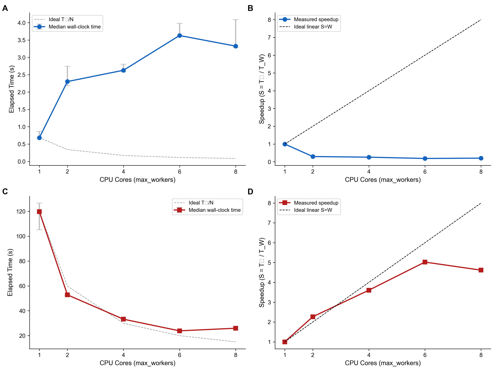
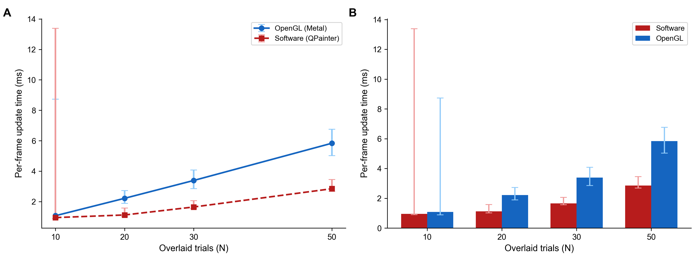
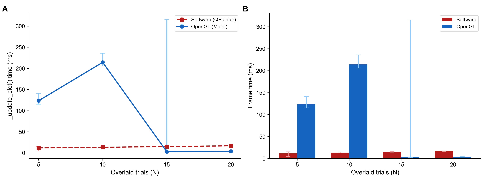

# Abstract
SynaptiPy is an open-source, Python-based software suite developed for the visualization and automated analysis of intracellular electrophysiology data. It provides a modular, metadata-driven graphical user interface (GUI) designed to resolve the methodological divide between inflexible commercial software and complex programmatic libraries. SynaptiPy supports over 15 distinct analytical modules encompassing intrinsic passive properties, single-spike kinetics, short-term synaptic plasticity, and optogenetic mapping. The application natively supports multiple proprietary file formats via the `neo` library and integrates Neurodata Without Borders (NWB) export capabilities to facilitate open-science reproducibility.

# Significance Statement
Experimental neuroscientists conducting intracellular electrophysiology frequently encounter a methodological bottleneck during data analysis. They must currently choose between proprietary GUI applications, which offer limited flexibility for automated high-throughput workflows, and programmatic libraries, which require advanced coding expertise and lack interactive visual validation. SynaptiPy bridges this gap by providing the analytical capabilities of modern Python libraries within a dynamic, accessible graphical environment. This enables researchers to perform rigorous, automated analysis across large experimental cohorts while maintaining complete algorithmic transparency and without requiring extensive programming knowledge.

# Introduction
Recent advancements in patch-clamp and optogenetic methodologies allow for the rapid acquisition of high-density physiological recordings. However, the manual quantification of these parameters remains highly time-consuming and susceptible to user bias. While several open-source initiatives have provided programmatic solutions, these tools are often tailored toward computational modelers rather than experimentalists. SynaptiPy addresses this limitation by offering a highly maintainable software application that prioritizes interactive visual validation, automated batch processing, and robust computational stability for wet-lab researchers.

# Materials and Methods (Software Architecture)

### 1. Metadata-Driven Architecture and Extensibility
To maximize long-term extensibility, SynaptiPy utilizes a decoupled, metadata-driven architecture. Rather than utilizing hard-coded user interfaces for individual analytical functions, the software employs a centralized `@AnalysisRegistry`. Researchers can implement custom algorithms via standard Python functions, which the application automatically parses to dynamically generate the required GUI elements, interactive plotting bounds, and batch-processing hooks. This abstraction allows users to expand the software’s capabilities without requiring familiarity with the underlying PySide6/Qt framework.

### 2. Automated Testing and Software Maintenance
A common limitation of academic software is dependency drift, where unmonitored updates to third-party libraries alter underlying calculations. To ensure long-term reproducibility, SynaptiPy is supported by a continuous integration and continuous deployment (CI/CD) pipeline with strict semantic dependency constraints. Furthermore, the repository employs baseline regression testing—executing the core analytical pipeline against raw experimental datasets (`.abf`, `.wcp`) during automated checks—to verify that upstream updates to core libraries (`SciPy`, `NumPy`) do not introduce silent mathematical deviations.

### 3. Interoperability and FAIR Data Standards
In accordance with FAIR (Findable, Accessible, Interoperable, and Reusable) data principles, SynaptiPy incorporates native Neurodata Without Borders (NWB) compliance. A dedicated export module translates proprietary manufacturer data arrays and user-generated analytical metadata into the open NWB standard, thereby streamlining data deposition and facilitating cross-laboratory reproducibility.

# Results (Biological Validation and Performance)

### 1. Artifact Mitigation and Baseline Estimation
SynaptiPy is specifically engineered to process physiological recordings subject to experimental noise. The core analytical modules incorporate configurable artifact-exclusion windows for series resistance ($R_s$) calculations, preventing capacitance misestimations. Additionally, the synaptic event detection algorithms utilize localized linear detrending to calculate accurate root-mean-square (RMS) noise floors, isolating thermal noise from slow baseline drift.

### 2. Algorithmic Transparency and Visual Validation
To facilitate user confidence in automated metrics, SynaptiPy relies heavily on visual validation. The software renders declarative overlays directly onto the raw electrophysiological traces via PyQtGraph. Users can visually confirm baseline assessment windows, spike threshold detection coordinates, and exponential decay kinetics superimposed on the raw data (e.g., excitatory postsynaptic potentials), ensuring that the algorithmic outputs accurately reflect the underlying biology.

*(biological validation figure, e.g., ``)*

### 3. High-Throughput Processing and Rendering Optimization
The integrated batch processing engine minimizes manual analysis bottlenecks, allowing for the rapid extraction of intrinsic properties and synaptic events across extensive experimental cohorts. To support this high-throughput capability, SynaptiPy utilizes significant rendering optimizations. End-to-end benchmarking indicates that the software maintains stable GUI execution times and smooth navigational frame rates even as the complexity and density of the multi-channel recordings scale:

*Figure 1: Batch execution scaling across increasing file complexities.*

*Figure 2: Rendering optimizations for high-frequency multichannel data.*

*Figure 3: Cross-platform end-to-end rendering stability.*

# Discussion (Comparison to Existing Tools)
Within the current landscape of intracellular electrophysiology software, SynaptiPy provides a distinct analytical utility:
* **Commercial Software (e.g., Clampfit):** While considered an industry standard, proprietary applications offer limited programmatic flexibility for high-throughput batch analysis. SynaptiPy provides comparable analytical rigor alongside comprehensive automation and an open-source (AGPL-3.0) license.
* **Programmatic Libraries (e.g., eFEL, pyABF):** Libraries such as the Electrophysiology Feature Extraction Library (eFEL) offer robust programmatic spike analysis but lack a graphical interface for visual verification. Similarly, `pyABF` provides excellent file I/O capabilities but requires users to construct independent analysis pipelines. SynaptiPy integrates these programmatic strengths into a cohesive visual platform.
* **GUI-Based Open-Source Applications (e.g., Stimfit):** Stimfit provides a highly respected C++ application; however, extending its functionality requires low-level programming expertise. SynaptiPy relies entirely on a Python-based architecture for simplified extensibility and includes native integration with modern NWB standards.

# Software Availability
* **License:** GNU Affero General Public License v3.0 (AGPL-3.0)
* **Operating Systems:** Windows, macOS, Linux
* **Source Code:** [https://github.com/anzalks/synaptipy](https://github.com/anzalks/synaptipy)
* **Archived Release:** [Zenodo DOI Here]
* **Documentation:** [https://synaptipy.readthedocs.io/](https://synaptipy.readthedocs.io/)

# References
*(References will be compiled via paper.bib)*