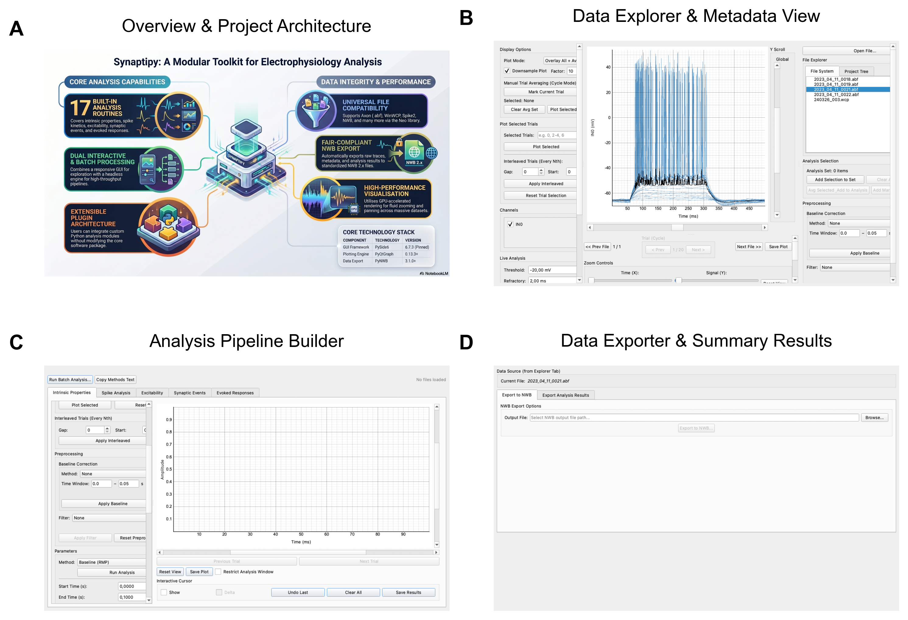
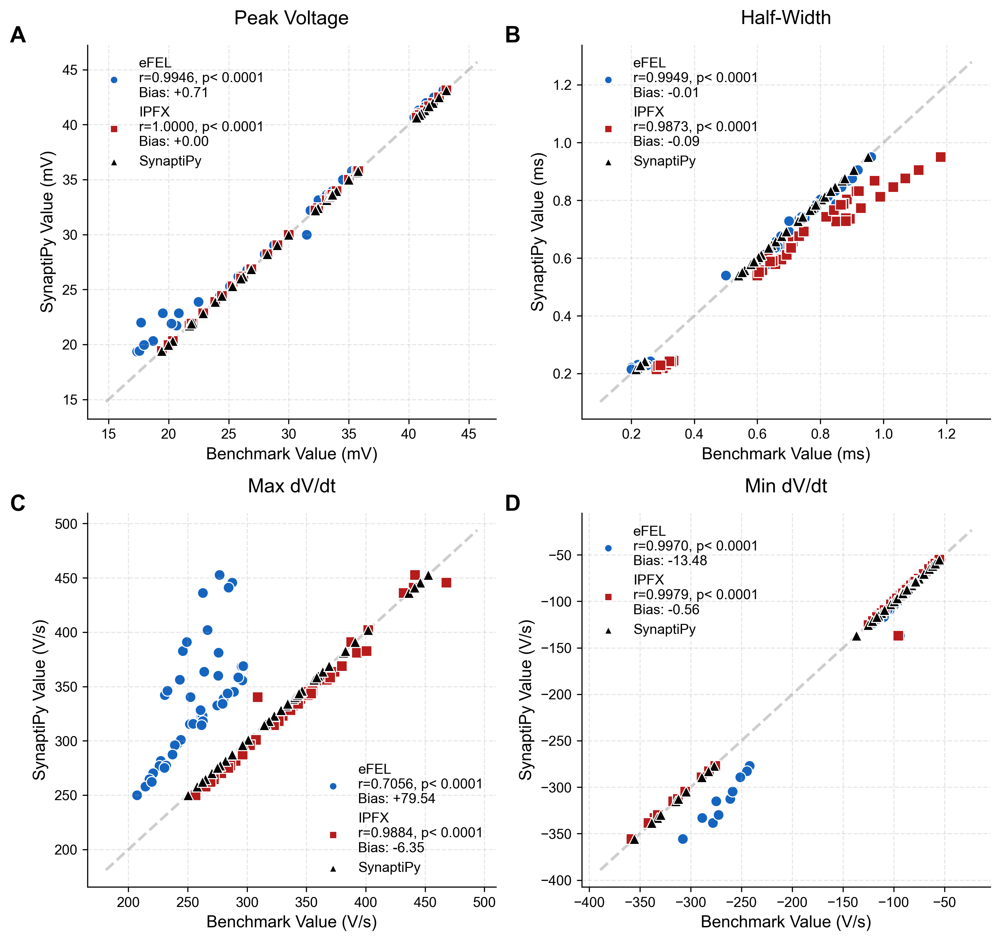
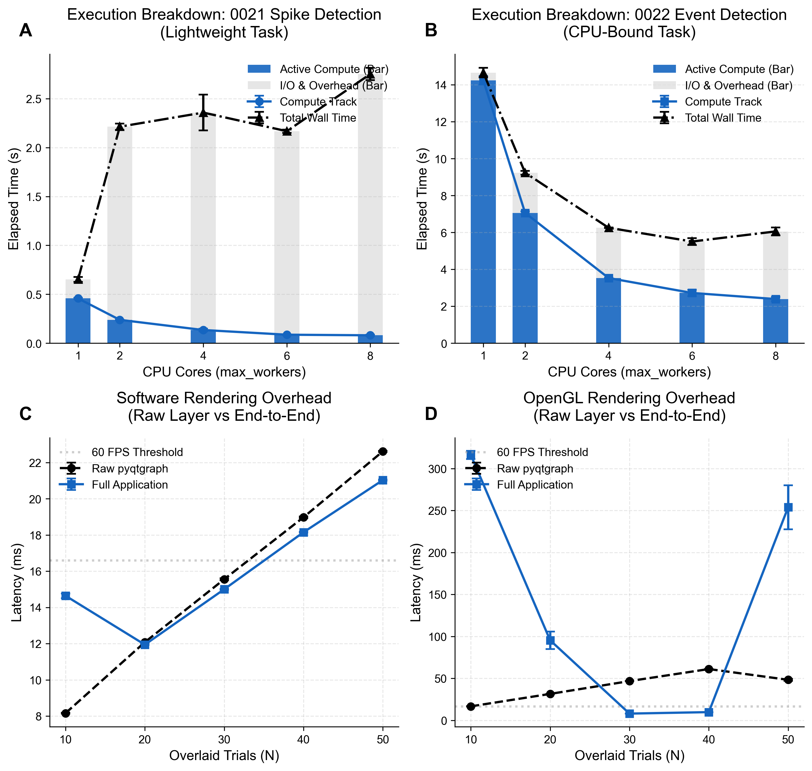

# Abstract
SynaptiPy is an open-source, all-in-one Python software developed for the visualization and automated analysis of intracellular electrophysiology data. It addresses the methodological divide between inflexible proprietary software and complex programmatic libraries by providing a responsive PyQt-based graphical user interface (GUI). Distributed across three major operating systems (macOS, Windows, Linux) via standard installation modes (`pip`, source, and standalone binaries), SynaptiPy natively incorporates broad amplifier-agnostic data parsing (e.g., Axon ABF, HEKA, WCP, NWB) via the `neo` library (Garcia et al., 2014). This multi-format compatibility allows diverse research groups to standardize their analytical pipelines regardless of the acquisition software used. Algorithmic accuracy was validated against standardized intracellular waveforms from adult male and female mouse cortical neurons (Allen Institute Cell Types Database). SynaptiPy introduces a metadata-driven plugin architecture that enables researchers to integrate custom algorithms as interactive GUI modules, effectively bridging the gap between exploratory visual inspection and headless batch processing.

# Significance Statement
Analyzing intracellular electrophysiology data presents a persistent methodological bottleneck; researchers frequently face a trade-off between rigid proprietary applications that limit automation and code-heavy libraries that require advanced programming expertise. This software divide creates equipment-based data silos and hinders reproducible research. SynaptiPy resolves this challenge by providing an open-source, unified analysis environment. By integrating interactive visual validation with automated batch processing and native multi-format compatibility, it enables laboratories to standardize analytical protocols regardless of the recording software they use. Ultimately, this tool eliminates proprietary silos, democratizes data analysis, and drives transparency and open science across the neuroscience community.

# Introduction
The automated analysis of electrophysiological data has a rich history of foundational tools that have vastly simplified researchers' workflows. Commercial applications such as **pClamp (Clampfit)** and **Axograph** established the gold standard for reliable visual inspection. Concurrently, community-driven environments like **Neuromatic** (Rothman and Silver, 2018) provided researchers with immense algorithmic extensibility within Igor Pro, while modern open-source applications like **WinWCP** (Dempster, 1997), **Stimfit** (Guzman et al., 2014), and **EasyElectrophysiology** (www.easyelectrophysiology.com) brought sophisticated analytics to standalone desktop environments.

However, as the field increasingly adopts open-source Python-based data science ecosystems, a methodological friction has emerged. Researchers often face a difficult transition between these established graphical applications and headless Python libraries (e.g., IPFX, eFEL). While recent Python-based visualizers like **PatchView** (Hu and Jiang, 2022) provide excellent standalone interfaces, they operate as pre-packaged applications that isolate users from integrating custom analysis workflows. Conversely, headless libraries require advanced scripting expertise and break the interactive visual validation loop that experimentalists rely upon.

SynaptiPy was designed specifically for experimentalists to address these limitations by prioritizing three core pillars: cross-platform accessibility, acquisition-agnostic data parsing, and decoupled plugin extensibility. Deploying natively on macOS, Windows, and Linux provides the stability needed to run identical analyses across diverse hardware. By leveraging community standards such as Neo (Garcia et al., 2014) to natively parse dozens of proprietary file formats, the application enables multi-lab collaborations to standardize pipelines regardless of the underlying amplifier. Driven by auto-detecting and a hot-reload plugin system, SynaptiPy allows users to seamlessly convert standard Python functions into interactive GUI modules, ensuring that graphical configurations and headless batch scripts share the exact same analytical code.

# Materials and Methods

## Metadata-Driven Plugin Architecture 
To maximize long-term extensibility, SynaptiPy employs a decoupled, metadata-driven architecture. Rather than relying on hard-coded user interfaces for individual analytical functions, the software is built around a centralized `@AnalysisRegistry` decorator. Researchers can implement custom algorithms via standard Python functions. By passing explicit keyword arguments (e.g., `ui_params`) into the registration decorator, users define parameter bounds and data types. The application then dynamically maps these inputs to corresponding Qt frontend widgets (e.g., `SpinBox`, `ComboBox`), ensuring custom coding logic is immediately accessible within the graphical interface.

## Multi-Format Parsing and GUI-to-Batch Parameter Serialization 
SynaptiPy leverages the Neo library (Garcia et al., 2014) to parse proprietary software files. Interactive parameter adjustments made in the GUI are fully reproducible in the headless `BatchAnalysisEngine`. Every analysis widget maps to a named entry in the `ui_params` list. When the user saves a session, these parameters are serialized to JSON format. The `BatchAnalysisEngine` accepts this identical dictionary format, ensuring that a batch result is mathematically equivalent to the interactive GUI result.

## Experimental Design and Statistical Analysis 
To quantify algorithmic reliability, SynaptiPy's feature-extraction metrics were validated against standardized intracellular waveforms obtained from the Allen Institute Cell Types Database. The automated pipeline targeted an initial cohort of $n = 6$ adult male and female mouse cortical cells. From the Neurodata Without Borders (NWB) data, step-protocol information was extracted and processed using SynaptiPy to confirm consistency with established analytical benchmarks.

## Code Accessibility
The code/software described in the paper is freely available online at [URL redacted for double-blind review]. The code is available as Extended Data 1. SynaptiPy is licensed under the GNU Affero General Public License v3.0 (AGPL-3.0). All analyses were performed on an Apple MacBook Pro (Apple M3 Pro, 18 GB RAM) running macOS 15.5 (Sequoia) and verified on Ubuntu 22.04 (x86_64). The Python environment was managed via miniconda (`conda-forge` channel), with core dependencies pinned as follows: PySide6 (v6.7.3), PyQtGraph (v0.13.7), Neo (v0.14.4) (Garcia et al., 2014), NumPy (v2.0.2) (Harris et al., 2020), SciPy (v1.17.1) (Virtanen et al., 2020), and Pandas (v3.0.2) (McKinney, 2010).

# Results

## Signal Conditioning and Dynamic Baseline Estimation 
Before feature extraction, SynaptiPy employs a robust signal-conditioning pipeline to mitigate experimental noise. For dynamic baseline estimation, the algorithm utilises localized detrending using a rolling median filter over the target epoch. To determine precise thresholds for active event detection, the pipeline isolates a minimum-variance sliding window to calculate a quiescent root-mean-square (RMS) noise floor. This approach mathematically isolates random high-frequency thermal noise from slow biological baseline drift, ensuring highly reliable feature extraction across variable recording conditions.

## Biophysically Accurate Passive Property Extraction 
To accurately capture subthreshold membrane dynamics, SynaptiPy abandons naive fixed-window subtractions in favor of biophysically representative calculations. Specifically, the passive properties module actively separates peak input resistance $R_{in}$ from steady-state $R_{in}$. This separation effectively isolates hyperpolarization-activated cyclic nucleotide-gated $I_h$ channel conductance, allowing for precise quantification of the voltage sag ratio. Because $I_h$ activation kinetics vary significantly across cell types and experimental temperatures, this analysis is exposed as a built-in plugin with dedicated UI controls, enabling experimentalists to dynamically adjust baseline, peak, and steady-state extraction windows to match specific biological realities while maintaining interactive visual validation.

## Algorithmic Parity against Computational Benchmarks
SynaptiPy successfully processed the targeted datasets via the `BatchAnalysisEngine`. To validate the feature extraction pipeline, the results were statistically compared with two established standards in the field: the Electrophysiology Feature Extraction Library (eFEL) (Mandge et al., 2026) and the Allen Institute's Intrinsic Physiology Feature Extractor (IPFX) (Gouwens et al., 2019).

For active properties, SynaptiPy utilized a standard dynamic derivative-crossing threshold ($dV/dt > 20$ V/s). The resulting measurements for action potential onset, amplitudes, and phase-plane dynamics demonstrated mathematical agreement with both libraries (Table 1, Figure 2). For subthreshold properties, SynaptiPy's dynamic extraction algorithms yielded steady-state input resistance, resting membrane potential, and time constant estimates that closely matched the results of eFEL and IPFX values (Table 2).

<!-- TABLES_START -->

**Table 2-1: Statistical summary of SynaptiPy AP extraction vs. eFEL and IPFX benchmarks (Allen Dataset, per-sweep means).**

| Metric | SynaptiPy vs IPFX Pearson *r* | Mean bias vs IPFX | LoA vs IPFX | SynaptiPy vs eFEL Pearson *r* | Mean bias vs eFEL | LoA vs eFEL |
|--------|-------------------------------|-------------------|-------------|-------------------------------|-------------------|-------------|
| AP threshold (mV) | 0.9277 (*p* = 3.76e-19)a | +0.052 mV | [-1.58, +1.68] mV | 0.9330 (*p* = 8.50e-20)b | +0.001 mV | [-1.51, +1.52] mV |
| AP amplitude (mV) | 0.9952 (*p* = 4.53e-43)c | -0.052 mV | [-1.68, +1.58] mV | 0.9902 (*p* = 1.11e-36)d | +0.706 mV | [-1.83, +3.24] mV |
| AP half-width (ms) | 0.9873 (*p* = 2.08e-34)e | -0.094 ms | [-0.19, +0.00] ms | 0.9949 (*p* = 1.66e-42)f | -0.012 ms | [-0.06, +0.03] ms |
| Max dV/dt (V/s) | 0.9884 (*p* = 3.17e-35)g | -6.352 V/s | [-21.84, +9.13] V/s | 0.7056 (*p* = 1.26e-07)h | +79.539 V/s | [+3.61, +155.47] V/s |
| AP Delay (Time to first spike) (ms) | 1.0000 (*p* = 0.00e+00)i | -0.000 ms | [-0.00, +0.00] ms | 1.0000 (*p* = 1.51e-98)j | -0.002 ms | [-0.06, +0.05] ms |
| Upstroke/Downstroke Ratio | 0.9998 (*p* = 1.41e-72)k | -0.070 Ratio | [-0.15, +0.01] Ratio | 0.9971 (*p* = 1.23e-47)l | +0.519 Ratio | [+0.22, +0.81] Ratio |
| Fast AHP depth (mV) | 0.9807 (*p* = 1.15e-30)m | +0.725 mV | [-3.79, +5.24] mV | 0.9513 (*p* = 6.00e-19)n | -1.884 mV | [-5.13, +1.36] mV |
| ADP amplitude (mV) | -0.3867 (*p* = 0.5203)o | -6.561 mV | [-13.62, +0.49] mV | 0.5881 (*p* = 3.37e-05)p | +2.929 mV | [-14.78, +20.64] mV |
| Mean Firing Frequency (Hz) | 1.0000 (*p* = 0.00e+00)q | +0.000 Hz | [-0.00, +0.00] Hz | 0.5951 (*p* = 2.57e-05)r | +23.921 Hz | [-50.78, +98.62] Hz |
| Spike Frequency Adaptation | 1.0000 (*p* = 1.31e-82)s | -0.000 Ratio | [-0.00, +0.00] Ratio | 0.7569 (*p* = 3.14e-06)t | +0.014 Ratio | [-0.03, +0.05] Ratio |

*All correlations are Pearson's r (two-sided) with exact *p*-values reported. Data reflects *n* = 43 sweeps where all three pipelines detected at least one action potential. Bias = mean signed difference (SynaptiPy minus benchmark, per-sweep means). LoA = 95% Bland-Altman limits of agreement. SynaptiPy: BatchAnalysisEngine spike_detection (dV/dt threshold 20 V/s, refractory 2 ms). eFEL: BlueBrain eFEL defaults. IPFX: Allen IPFX SpikeFeatureExtractor, 9.9 kHz Bessel filter. Superscript letters refer to the statistical table. N/A = no direct benchmark equivalent.*

**Table 2-2: Subthreshold passive properties benchmark on hyperpolarizing steps (Allen Dataset).**

| Metric | Valid *N* | SynaptiPy vs eFEL Pearson *r* | Mean bias vs eFEL | LoA vs eFEL | SynaptiPy vs IPFX Pearson *r* | Mean bias vs IPFX | LoA vs IPFX |
|--------|-----------|-------------------------------|-------------------|-------------|-------------------------------|-------------------|-------------|
| Resting Membrane Potential (mV) | 34 | 0.9825 (*p* = 6.24e-25)u | -2.224 mV | [-3.06, -1.39] mV | 0.9999 (*p* = 6.54e-61)v | -0.125 mV | [-0.18, -0.06] mV |
| Input Resistance — Steady-State (MΩ) † | 34 | 0.9995 (*p* = 8.98e-50)w | +0.258 MΩ | [-2.76, +3.28] MΩ | N/A | N/A | N/A |
| Input Resistance — Peak (MΩ) ‡ | 34 | N/A | N/A | N/A | 0.5065 (*p* = 0.0022)x | -6.561 MΩ | [-126.09, +112.97] MΩ |
| Membrane Time Constant (ms) | 34 | 0.2547 (*p* = 0.1461)y | -18.485 ms | [-92.86, +55.89] ms | 0.9013 (*p* = 0.0056)z | -2.126 ms | [-10.43, +6.17] ms |
| Sag Percentage (%) | 34 | -0.9894 (*p* = 2.09e-28)aa | -87.285 % | [-109.62, -64.95] % | 0.9558 (*p* = 1.44e-18)bb | +3.820 % | [-2.96, +10.60] % |

*All correlations are Pearson's r (two-sided) with exact *p*-values reported. LoA = 95% Bland-Altman limits of agreement (mean ± 1.96 SD of sweep-level differences). † SS-Rin: mean voltage in last 100 ms of step (matches eFEL ohmic_input_resistance). ‡ Peak-Rin: maximum hyperpolarization deflection (matches IPFX voltage_deflection). Superscript letters refer to the statistical table. N/A = no direct benchmark equivalent.*

**Statistical Table**

| | Data structure | Type of test | Statistical value |
|---|---|---|---|
| a | Non-normal distribution | Pearson correlation (two-sided, *n* = 43) | N/A |
| b | Non-normal distribution | Pearson correlation (two-sided, *n* = 43) | N/A |
| c | Normal distribution | Pearson correlation (two-sided, *n* = 43) | N/A |
| d | Normal distribution | Pearson correlation (two-sided, *n* = 43) | N/A |
| e | Non-normal distribution | Pearson correlation (two-sided, *n* = 43) | N/A |
| f | Non-normal distribution | Pearson correlation (two-sided, *n* = 43) | N/A |
| g | Normal distribution | Pearson correlation (two-sided, *n* = 43) | N/A |
| h | Normal distribution | Pearson correlation (two-sided, *n* = 43) | N/A |
| i | Normal distribution | Pearson correlation (two-sided, *n* = 36) | N/A |
| j | Normal distribution | Pearson correlation (two-sided, *n* = 36) | N/A |
| k | Non-normal distribution | Pearson correlation (two-sided, *n* = 43) | N/A |
| l | Non-normal distribution | Pearson correlation (two-sided, *n* = 43) | N/A |
| m | Non-normal distribution | Pearson correlation (two-sided, *n* = 43) | N/A |
| n | Non-normal distribution | Pearson correlation (two-sided, *n* = 36) | N/A |
| o | Non-normal distribution | Pearson correlation (two-sided, *n* = 5) | N/A |
| p | Non-normal distribution | Pearson correlation (two-sided, *n* = 43) | N/A |
| q | Non-normal distribution | Pearson correlation (two-sided, *n* = 43) | N/A |
| r | Non-normal distribution | Pearson correlation (two-sided, *n* = 43) | N/A |
| s | Non-normal distribution | Pearson correlation (two-sided, *n* = 30) | N/A |
| t | Non-normal distribution | Pearson correlation (two-sided, *n* = 28) | N/A |
| u | Non-normal distribution | Pearson correlation (two-sided, *n* = 34) | N/A |
| v | Non-normal distribution | Pearson correlation (two-sided, *n* = 34) | N/A |
| w | Normal distribution | Pearson correlation (two-sided, *n* = 34) | N/A |
| x | Normal distribution | Pearson correlation (two-sided, *n* = 34) | N/A |
| y | Non-normal distribution | Pearson correlation (two-sided, *n* = 34) | N/A |
| z | Non-normal distribution | Pearson correlation (two-sided, *n* = 7) | N/A |
| aa | Non-normal distribution | Pearson correlation (two-sided, *n* = 34) | N/A |
| bb | Non-normal distribution | Pearson correlation (two-sided, *n* = 34) | N/A |

<!-- TABLES_END -->

## Biological Use-Case Demonstration 
Beyond standalone mathematical validation, SynaptiPy offers immediate utility for experimental workflows (Figure 3). End-to-end benchmarking indicates that the software maintains stable execution times even as recording complexity scales. In headless batch mode, core spike detection completes in approximately 68.5 ms per multi-sweep recording, allowing high-throughput processing across multiple CPU cores (Figure 3A). Furthermore, under software rendering, the full end-to-end application loop remains responsive, ranging from 14 to 18 ms for 10 to 20 overlaid trials (Figure 3C).

# Discussion
Within the current landscape of intracellular electrophysiology software, SynaptiPy provides a unified analytical utility explicitly tailored to experimental workflows. It is not intended to replace the deep, highly specialized functionality of established suites such as **Neuromatic** or **EasyElectrophysiology**, but rather to serve as a complementary bridge to the Python ecosystem.

While software packages like **Clampfit** and **Axograph** remain robust industry standards, their proprietary formats and platform dependencies can create friction in multi-lab collaborations spanning macOS and Linux. By combining the interactive GUI experience of tools like **Stimfit** with a pure Python backend, SynaptiPy allows researchers to sync their analysis protocols using a universal standard (Table 3).

**Table 3: Feature comparison of SynaptiPy against prominent electrophysiology tools.**

| Feature | SynaptiPy | Clampfit | Stimfit | Neuromatic (Igor) | EasyElectrophysiology |
| :--- | :--- | :--- | :--- | :--- | :--- |
| **Interactive GUI** | Yes | Yes | Yes | Yes | Yes |
| **Batch Engine** | Yes (Python) | Limited | Yes (Python/C++) | Yes (Igor Pro) | Limited |
| **Multi-Format Loading** | Yes | No | Yes | Limited | Yes |
| **OS Compatibility** | Win, macOS, Linux | Win | Win, macOS, Linux | Win, macOS | Win, macOS, Linux |

**Limitations**: SynaptiPy currently focuses exclusively on *in vitro* patch-clamp and optogenetic datasets. It does not implement clustering or spike-train heuristics for *in vivo* extracellular multi-electrode arrays (MEAs), a domain already expertly served by broader Python ecosystem libraries such as **Elephant** and **Pynapple**. The open-source community is actively invited to leverage the decoupled `@AnalysisRegistry` to expand these functionalities.

# References

Dempster J (1997) A new version of the Strathclyde Electrophysiology software package running within the Microsoft Windows environment. *J Physiol* 504:P57–P57.

Garcia S, Guarino D, Jaillet F, Jennings TR, Pröpper R, Rautenberg PL, Rodgers C, Sobolev A, Wachtler T, Yger P, Davison AP (2014) Neo: an object model for handling electrophysiology data in multiple formats. *Front Neuroinform* 8:10. doi:10.3389/fninf.2014.00010

Gouwens NW et al. (2019) Classification of electrophysiological and morphological neuron types in the mouse visual cortex. *Nat Neurosci* 22:1182–1195. doi:10.1038/s41593-019-0417-0

Guzman SJ, Schlögl A, Schmidt-Hieber C (2014) Stimfit: quantifying electrophysiological data with Python. *Front Neuroinform* 8:16. doi:10.3389/fninf.2014.00016

Harris CR, Millman KJ, van der Walt SJ, Gommers R, Virtanen P, Cournapeau D, Wieser E, Taylor J, Berg S, Smith NJ, Kern R, Picus M, Hoyer S, van Kerkwijk MH, Brett M, Haldane A, del Río JF, Wiebe M, Peterson P, Gérard-Marchant P, Sheppard K, Reddy T, Weckesser W, Abbasi H, Gohlke C, Oliphant TE (2020) Array programming with NumPy. *Nature* 585:357–362. doi:10.1038/s41586-020-2649-2

Hu M, Jiang X (2022) PatchView: a Python package for patch-clamp data analysis and visualization. *J Open Source Softw* 7:4706. doi:10.21105/joss.04706

Mandge D, Tuncel A, Jaquier A, Kilic I, Damart T, Markram H, Van Geit W, Ranjan R (2026) eFEL: electrophysiology feature extraction library. *Bioinformatics* 42:btag328. doi:10.1093/bioinformatics/btag328

McKinney W (2010) Data structures for statistical computing in Python. In: Proceedings of the 9th Python in Science Conference, pp56–61. doi:10.25080/Majora-92bf1922-00a

Rothman JS, Silver RA (2018) NeuroMatic: an integrated open-source software toolkit for acquisition, analysis and simulation of electrophysiological data. *Front Neuroinform* 12:14. doi:10.3389/fninf.2018.00014

Virtanen P, Gommers R, Oliphant TE, Haberland M, Reddy T, Cournapeau D, Burovski E, Peterson P, Weckesser W, Bright J, van der Walt SJ, Brett M, Wilson J, Millman KJ, Mayorov N, Nelson ARJ, Jones E, Kern R, Larson E, Carey CJ, Polat İ, Feng Y, Moore EW, VanderPlas J, Laxalde D, Perktold J, Cimrman R, Henriksen I, Quintero EA, Harris CR, Archibald AM, Ribeiro AH, Pedregosa F, van Mulbregt P (2020) SciPy 1.0: fundamental algorithms for scientific computing in Python. *Nat Methods* 17:261–272. doi:10.1038/s41592-019-0686-2

# Figure Legends

**Figure 1.** SynaptiPy architectural workflow and graphical user interface. **(A)** Schematic overview of core capabilities, emphasizing the integration of a metadata-driven plugin architecture with cross-platform batch processing. **(B)** The Data Explorer interface, enabling hierarchical file navigation and interactive inspection of raw electrophysiological sweeps. **(C)** The Analysis Pipeline Builder, configuring modular analysis workflows for intrinsic and active properties. **(D)** The Data Exporter module for consolidating and exporting batch results.

**Figure 2.** Algorithmic parity against established computational benchmarks. **(A–D)** Scatter plots comparing SynaptiPy feature extractions against eFEL (blue circles) and IPFX (red squares) for core action potential metrics: Peak Voltage (A), Half-Width (B), Maximum dV/dt (C), and Minimum dV/dt (D). Black triangles represent SynaptiPy plotted against itself to define the unity line of perfect agreement. Pearson correlation coefficients ($r$) and mean biases are provided in each panel.

**Figure 3.** Computational scaling and UI rendering benchmarks. **(A, B)** Multi-core scaling efficiency of the `BatchAnalysisEngine`, resolving execution times into active compute (blue bars) versus I/O overhead (grey bars) for a lightweight spike detection task (A) and a CPU-bound event detection task (B). **(C, D)** Rendering latency as a function of overlaid experimental sweeps. Latency is compared between the raw `pyqtgraph` rendering layer (black circles) and the full end-to-end application GUI loop (blue squares) under both software (C) and OpenGL-accelerated (D) modes. The 16.6 ms latency threshold required to maintain 60 FPS interactivity is indicated by the horizontal dashed line.

# Extended Data Legends

**Extended Data 1.** SynaptiPy source code (ZIP archive). The complete source code for the SynaptiPy software package, including all analysis modules, GUI components, plugin architecture, and batch processing engine.
