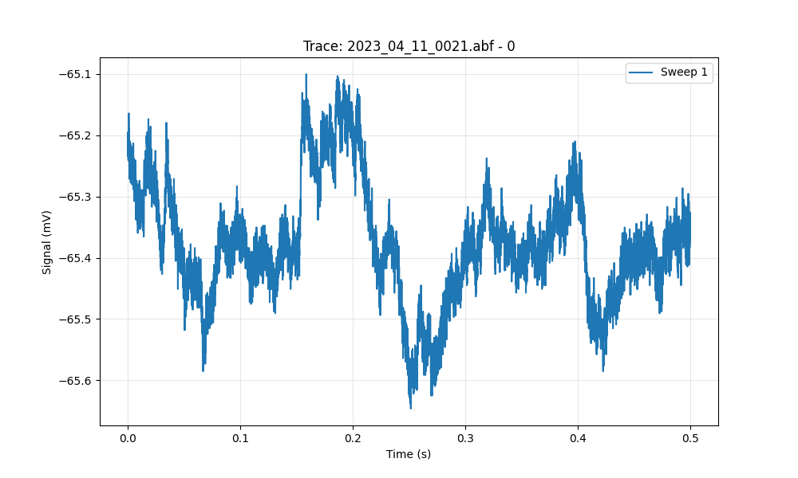

# Synaptipy Verification Report

**Date:** 2025-11-21 10:02:55.698911

## Analysis Results

| file_name           | file_path                         |   channel |   sampling_rate |   spike_count |   mean_freq_hz |
|:--------------------|:----------------------------------|----------:|----------------:|--------------:|---------------:|
| 2023_04_11_0021.abf | examples/data/2023_04_11_0021.abf |         0 |         20000   |             0 |            nan |
| 2023_04_11_0022.abf | examples/data/2023_04_11_0022.abf |         0 |         20000   |             0 |            nan |
| 2023_04_11_0022.abf | examples/data/2023_04_11_0022.abf |         1 |         20000   |             0 |            nan |
| 2023_04_11_0022.abf | examples/data/2023_04_11_0022.abf |         2 |         20000   |             0 |            nan |
| 2023_04_11_0022.abf | examples/data/2023_04_11_0022.abf |         3 |         20000   |             0 |            nan |
| 2023_04_11_0018.abf | examples/data/2023_04_11_0018.abf |         0 |         20000   |             0 |            nan |
| 2023_04_11_0019.abf | examples/data/2023_04_11_0019.abf |         0 |         20000   |             0 |            nan |
| 240326_003.wcp      | examples/data/240326_003.wcp      |         0 |         20080.3 |             1 |              0 |

## Visualizations

